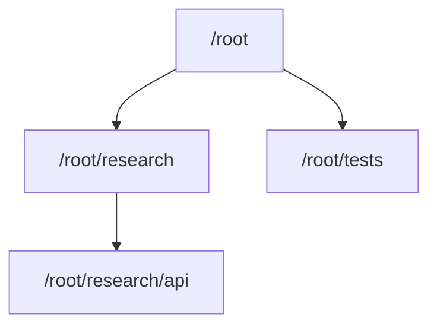

Codex `0.145.0` is the first release that makes me want to test Agents V2
seriously. OpenAI now labels the `multi_agent_v2` feature flag stable but leaves
it disabled by default. Turning it on explicitly forces V2. The release also
includes work on concurrency, model selection, roles, and navigation.
<SourceLink href="https://github.com/openai/codex/pull/34383">PR #34383</SourceLink>
spells out the flag behavior. Without that override, Codex can still choose the
backend from model metadata. In the tagged catalog, GPT-5.6 Sol and Terra select
V2 while Luna selects V1.
<SourceLink href="https://github.com/openai/codex/blob/rust-v0.145.0/codex-rs/models-manager/models.json">The tagged model catalog</SourceLink>
and the
<SourceLink href="https://github.com/openai/codex/blob/rust-v0.145.0/codex-rs/core/src/config/mod.rs#L1433-L1461">backend-selection implementation</SourceLink>
show how the feature override and model preference combine.

<Callout title="Verified locally" variant="note">
  I verified this article on July 22, 2026 with Codex CLI `0.145.0`. On my machine,
  `multi_agent` and `multi_agent_v2` both reported `stable` and `true`, and I used
  the V2 task-path tools successfully. This describes my setup on that date. It
  does not mean every Codex Desktop or CLI session is already using V2.
</Callout>

## The short version

- The `multi_agent_v2` feature flag is stable and off by default; enabling it
  forces V2, although model metadata may already select V2.
- V2 replaces a flat collection of agent IDs with a navigable task hierarchy.
- Context inheritance is explicit, and V2 defines how parent and child mailboxes
  behave.
- `0.145.0` includes updates to agent roles, model defaults, cold resume, and TUI
  navigation.
- The agents still share one working directory and filesystem. V2 is coordination,
  not worktree isolation.
- `max_concurrent_threads_per_session = 8` allows **eight spawned-agent threads
  across the session tree, plus the root: nine open thread slots in total**.

## What changed from V1

The agent count is not the interesting part. V2 gives each branch of work a name
and a place in the task tree, then defines how those branches communicate. The
tagged
<SourceLink href="https://github.com/openai/codex/blob/rust-v0.145.0/codex-rs/core/src/tools/handlers/multi_agents_spec.rs">V1 and V2 tool definitions</SourceLink>
show the difference.

| Area             | Agents V1                                            | Agents V2                                                                        |
| ---------------- | ---------------------------------------------------- | -------------------------------------------------------------------------------- |
| Identity         | Opaque agent IDs                                     | Canonical task paths such as `/root/research/api`                                |
| Context at spawn | `fork_context` on or off                             | `fork_turns` accepts `none`, `all`, or a recent-turn count                       |
| Communication    | `send_input`, targeted waits, resume and close by ID | `send_message`, `followup_task`, mailbox waiting, interruption, and tree listing |
| Nesting          | Governed by `agents.max_depth`                       | Hierarchical nesting; `max_depth` is ignored                                     |
| TUI ownership    | Spawned V1 threads accept direct input               | Parent-owned V2 threads are inspectable but read-only                            |
| Configuration    | Legacy flat-agent behavior                           | Per-spawn choices, shared defaults, and durable named roles                      |

### A task tree instead of a flat pool

Every V2 spawn requires a lowercase `task_name`. Codex resolves it to a canonical
path below the spawning agent. A child can spawn another child, and the paths
preserve that relationship:



That hierarchy becomes useful when a task has nested subproblems. The root might
delegate release research, and that agent can pass a focused source audit to its
own child. The root can still address either one by its canonical path, while
`list_agents` can narrow the view by path prefix.

### Context forking is explicit

V2 replaces the old context boolean with `fork_turns`. The tagged spawn handler
accepts three forms:

```text title="V2 spawn context options"
fork_turns = "all"   # full history; the default
fork_turns = "none"  # no conversation history
fork_turns = "5"     # the five most recent turns
```

I can now choose context based on the subtask. A reviewer may need the recent
design conversation; a repository explorer may only need a precise assignment.
The
<SourceLink href="https://github.com/openai/codex/blob/rust-v0.145.0/codex-rs/core/src/tools/handlers/multi_agents_v2/spawn.rs">tagged V2 spawn implementation</SourceLink>
shows the exact parser and its default.

### Messages and follow-up work are separate

The two message operations do different jobs:

- `send_message` delivers information without starting a new agent turn.
- `followup_task` gives an existing agent more work and triggers a turn when it is
  idle.

A message can carry information without turning into another assignment. Agents
can wait for mailbox updates, be interrupted, or be listed by task path. The
<SourceLink href="https://github.com/openai/codex/blob/rust-v0.145.0/codex-rs/core/src/tools/handlers/multi_agents_spec.rs">tagged collaboration tool schema</SourceLink>
defines these semantics.

### Roles survive a cold resume

Named roles are more practical in V2. A role can provide human-facing guidance,
a role-specific config layer, and nickname candidates:

```toml title="~/.codex/config.toml"
[agents.researcher]
description = "Audit primary sources and report evidence with links."
config_file = "./agents/researcher.toml"
nickname_candidates = ["Ada", "Grace"]
```

Relative role files resolve from the `config.toml` that defines them. In `0.145.0`,
cold resume also preserves the selected role configuration when a durable V2 agent
reloads. The integration test covers role-defined instructions, model, provider,
reasoning effort, and permissions.
<SourceLink href="https://github.com/openai/codex/pull/33657">PR #33657</SourceLink>
documents the fix.

### Child threads are deliberately read-only

In the TUI, I can open and inspect a parent-owned V2 child, but direct input is
rejected. Communication goes through its parent using the V2 tools. That is an
intentional ownership rule, not a missing composer feature. Codex preserves
drafts and queued input while the thread is open for inspection.
<SourceLink href="https://github.com/openai/codex/pull/33841">PR #33841</SourceLink>
explains the rationale and tests both writable V1 threads and view-only V2 threads.

## How to enable Agents V2

One feature flag is enough to force V2:

```toml title="~/.codex/config.toml"
[features]
multi_agent_v2 = true
```

The CLI can write the same setting:

```sh title="Enable Agents V2"
codex features enable multi_agent_v2
```

After changing the backend selection, I start a fresh task before testing V2. I do
not use the removed `multi_agent_mode` compatibility flag; it is a no-op in this
release.

### My working configuration

Here is the exact configuration I use:

```toml title="~/.codex/config.toml"
[agents]
enabled = true
max_concurrent_threads_per_session = 8

[features]
multi_agent_v2 = true
```

`agents.enabled = true` is explicit but redundant. The configuration schema says
multi-agent tools default to enabled, and an enabled V2 flag takes precedence. I
also do not set `default_subagent_model` or `default_subagent_reasoning_effort`, so
this configuration does not force every spawned agent onto a particular model or
effort. Those optional defaults only apply when a spawn does not select its own
values.
<SourceLink href="https://github.com/openai/codex/blob/rust-v0.145.0/codex-rs/core/config.schema.json">The tagged configuration schema</SourceLink>
is the authoritative reference for these fields.

<Callout title="Eight means eight spawned agents" variant="warning">
  Under `[agents]`, `max_concurrent_threads_per_session` counts spawned-agent threads
  that are open across the session tree. A value of `8` allows eight spawned-agent
  threads plus the root: nine open thread slots in total. The setting caps
  concurrency; it does not ask Codex to fill those slots.
</Callout>

The same schema marks the old `max_depth` setting as V1-only and says V2 ignores
it. I control V2 fan-out with the concurrency ceiling and clear task boundaries
instead.

### Verify the effective state

I check the installed version and the relevant feature rows together:

```sh title="Verify Codex and feature state"
codex --version
codex features list
```

The relevant output on July 22, 2026 was:

```text title="Relevant local output"
codex-cli 0.145.0
multi_agent       stable  true
multi_agent_v2    stable  true
multi_agent_mode  removed false
```

The available tools provide a second runtime check. `spawn_agent` requires a
`task_name`, and the session exposes tools such as `send_message`, `followup_task`,
`list_agents`, and `interrupt_agent`. The feature list shows the configured flags;
the tool surface shows what the active task can use.

## High versus Ultra reasoning

Agents V2 works with both High and Ultra reasoning. The difference is when Codex
is encouraged to delegate. At High, I ask explicitly when I want parallel agents.
Ultra enables proactive multi-agent behavior, although Codex can still keep a
small or tightly coupled task with one agent.

The old `multiAgentMode` setting is deprecated and ignored; the tagged app-server
documentation identifies Ultra reasoning as the source of proactive delegation.
<SourceLink href="https://github.com/openai/codex/blob/rust-v0.145.0/codex-rs/app-server/README.md">The app-server protocol reference</SourceLink>
states this directly.

At High, a prompt can be as simple as:

```text title="Explicit delegation at High"
Use Agents V2 where the work is independent. Delegate source research,
implementation, and verification, then integrate the result in the root task.
```

Ultra can delegate proactively, but it does not have to. The concurrency setting
only caps open threads; it does not say how many Codex should use. Clear task
boundaries matter more than whether the ceiling is six or eight.

## The shared-workspace caveat

V2 agents share a workspace instead of getting separate worktrees. The injected
guidance is explicit: every agent uses the same container, filesystem, and current
working directory, and sees edits immediately.
<SourceLink href="https://github.com/openai/codex/blob/rust-v0.145.0/codex-rs/core/src/config/mod.rs">The tagged configuration implementation</SourceLink>
contains that guidance.

<Callout title="Coordinate writers" variant="warning">
  Two agents editing the same file can still collide. I give agents separate files
  or read-only investigations, assign one owner per write boundary, and leave final
  integration and broad verification to the root agent.
</Callout>

I treat Agents V2 as an orchestration upgrade. Task paths, selective context,
mailboxes, and durable roles make concurrent work easier to track, but I still
have to split the work along safe boundaries.

## Is V2 worth enabling?

For broad repository work, yes. In `0.145.0`, the feature is stable, and I think
the surrounding changes justify a serious trial. The explicit task tree is the
main improvement for me. Choosing how much history each child receives also helps,
as does separating information from new work.

I would not claim speed, cost, or quality improvements from the architecture alone.
Those claims need measurements on real tasks. I also would not use agents merely to
fill eight slots. For a small change, one capable root agent is often the better
choice. When research, implementation, tests, and review can proceed independently,
V2 gives them a much clearer coordination structure.

My minimal setup has worked cleanly so far. I turn on the flag when I want to force
V2, start a fresh task, and check the exposed tools. I only raise the concurrency
limit when I can draw clean boundaries between the pieces of work.

## Sources

- <SourceLink href="https://github.com/openai/codex/releases/tag/rust-v0.145.0">Codex 0.145.0 release notes</SourceLink>
- <SourceLink href="https://github.com/openai/codex/pull/34383">PR #34383: mark multi-agent V2 as stable</SourceLink>
- <SourceLink href="https://github.com/openai/codex/blob/rust-v0.145.0/codex-rs/features/src/lib.rs">Tagged feature registry</SourceLink>
- <SourceLink href="https://github.com/openai/codex/blob/rust-v0.145.0/codex-rs/core/config.schema.json">Tagged configuration schema</SourceLink>
- <SourceLink href="https://github.com/openai/codex/blob/rust-v0.145.0/codex-rs/core/src/config/mod.rs">Tagged backend selection and V2 guidance</SourceLink>
- <SourceLink href="https://github.com/openai/codex/blob/rust-v0.145.0/codex-rs/core/src/tools/handlers/multi_agents_spec.rs">Tagged V1 and V2 tool definitions</SourceLink>
- <SourceLink href="https://github.com/openai/codex/blob/rust-v0.145.0/codex-rs/core/src/tools/handlers/multi_agents_v2/spawn.rs">Tagged V2 spawn and context-fork implementation</SourceLink>
- <SourceLink href="https://github.com/openai/codex/pull/33550">PR #33550: unify multi-agent settings under `agents`</SourceLink>
- <SourceLink href="https://github.com/openai/codex/pull/33631">PR #33631: honor configured model defaults</SourceLink>
- <SourceLink href="https://github.com/openai/codex/pull/33657">PR #33657: restore roles when reloading V2 agents</SourceLink>
- <SourceLink href="https://github.com/openai/codex/pull/33841">PR #33841: make parent-owned V2 threads read-only</SourceLink>
- <SourceLink href="https://github.com/openai/codex/blob/rust-v0.145.0/codex-rs/app-server/README.md">Tagged app-server protocol reference</SourceLink>
