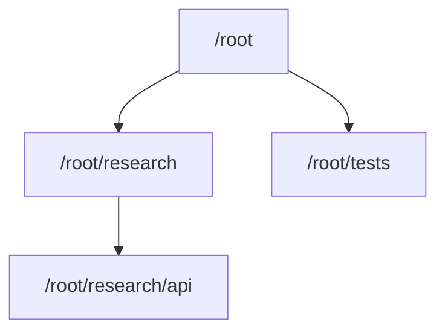

Codex `0.145.0` is the release where I would start actively testing Agents V2.
OpenAI describes the `multi_agent_v2` feature flag as stabilized but opt-in, with
work across concurrency, model selection, roles, and navigation. More precisely,
the flag is stable and disabled by default; enabling it explicitly forces V2.
<SourceLink href="https://github.com/openai/codex/pull/34383">PR #34383</SourceLink>
is unusually explicit about both halves of that decision. Without the override,
the effective backend can still come from model metadata: in the tagged catalog,
GPT-5.6 Sol and Terra select V2 while Luna selects V1.
<SourceLink href="https://github.com/openai/codex/blob/rust-v0.145.0/codex-rs/models-manager/models.json">The tagged model catalog</SourceLink>
and the
<SourceLink href="https://github.com/openai/codex/blob/rust-v0.145.0/codex-rs/core/src/config/mod.rs#L1433-L1461">backend-selection implementation</SourceLink>
show how the feature override and model preference combine.

<Callout title="Verified locally" variant="note">
I verified this article on July 22, 2026 with Codex CLI `0.145.0`. On my machine,
`multi_agent` and `multi_agent_v2` both reported `stable` and `true`, and I used
the V2 task-path tools successfully. That is a dated report of my configuration,
not a claim that every Codex Desktop or CLI session is already using V2.
</Callout>

## The short version

- The `multi_agent_v2` feature flag is stable and off by default; enabling it
  forces V2, although model metadata may already select V2.
- V2 replaces a flat collection of agent IDs with a navigable task hierarchy.
- Context inheritance is explicit, and parent/child communication has clearer
  mailbox semantics.
- Agent roles, model defaults, cold resume, and TUI navigation received meaningful
  release work.
- The agents still share one working directory and filesystem. V2 is coordination,
  not worktree isolation.
- `max_concurrent_threads_per_session = 8` allows **eight spawned-agent threads
  across the session tree, plus the root: nine open thread slots in total**.

## What actually changed from V1

The useful difference is not raw agent count. V2 gives the agent tree names,
structure, and explicit communication rules. The tagged
<SourceLink href="https://github.com/openai/codex/blob/rust-v0.145.0/codex-rs/core/src/tools/handlers/multi_agents_spec.rs">V1 and V2 tool definitions</SourceLink>
make the contrast concrete.

| Area | Agents V1 | Agents V2 |
| --- | --- | --- |
| Identity | Opaque agent IDs | Canonical task paths such as `/root/research/api` |
| Context at spawn | `fork_context` on or off | `fork_turns` accepts `none`, `all`, or a recent-turn count |
| Communication | `send_input`, targeted waits, resume and close by ID | `send_message`, `followup_task`, mailbox waiting, interruption, and tree listing |
| Nesting | Governed by `agents.max_depth` | Hierarchical nesting; `max_depth` is ignored |
| TUI ownership | Spawned V1 threads accept direct input | Parent-owned V2 threads are inspectable but read-only |
| Configuration | Legacy flat-agent behavior | Per-spawn choices, shared defaults, and durable named roles |

### A task tree instead of a flat pool

Every V2 spawn requires a lowercase `task_name`. Codex resolves that name into a
canonical path below the spawning agent, so a child can create its own child
without losing the shape of the work:



That structure matters when a larger task has a real hierarchy: the root can
delegate release research, the research agent can delegate a focused source audit,
and the root can still address either path directly. `list_agents` can also narrow
the view by path prefix.

### Context forking is explicit

V2 replaces the old context boolean with `fork_turns`. The tagged spawn handler
accepts three forms:

```text title="V2 spawn context options"
fork_turns = "all"   # full history; the default
fork_turns = "none"  # no conversation history
fork_turns = "5"     # the five most recent turns
```

This lets me match context to the subtask. A reviewer may need the recent design
conversation; a repository explorer may only need a precise assignment. The exact
parser and its default are visible in the
<SourceLink href="https://github.com/openai/codex/blob/rust-v0.145.0/codex-rs/core/src/tools/handlers/multi_agents_v2/spawn.rs">tagged V2 spawn implementation</SourceLink>.

### Messaging now expresses intent

The two core message operations do different jobs:

- `send_message` delivers information without starting a new agent turn.
- `followup_task` gives an existing agent more work and triggers a turn when it is
  idle.

Together with mailbox-aware waiting, interruption, and path-based listing, that
makes coordination less ambiguous than treating every message as more work. These
semantics are defined in the
<SourceLink href="https://github.com/openai/codex/blob/rust-v0.145.0/codex-rs/core/src/tools/handlers/multi_agents_spec.rs">tagged collaboration tool schema</SourceLink>.

### Roles survive a real resume

V2 also makes named roles more useful. A role can provide human-facing guidance,
a role-specific config layer, and nickname candidates:

```toml title="~/.codex/config.toml"
[agents.researcher]
description = "Audit primary sources and report evidence with links."
config_file = "./agents/researcher.toml"
nickname_candidates = ["Ada", "Grace"]
```

Relative role files resolve from the `config.toml` that defines them. More
importantly, `0.145.0` repairs cold resume so a durable V2 agent retains its selected
role configuration when reloaded. The integration test covers role-defined
instructions, model, provider, reasoning effort, and permissions.
<SourceLink href="https://github.com/openai/codex/pull/33657">PR #33657</SourceLink>
documents that repair.

### Child threads are deliberately read-only

In the TUI, a parent-owned V2 child is available for navigation and inspection,
but direct input is rejected. Communication goes through its parent using the V2
tools. This is ownership semantics, not a missing composer feature; drafts and
queued input are preserved while the thread is viewed.
<SourceLink href="https://github.com/openai/codex/pull/33841">PR #33841</SourceLink>
contains both the rationale and the V1-writable/V2-view-only test coverage.

## How to enable Agents V2

The minimum explicit opt-in is one feature flag:

```toml title="~/.codex/config.toml"
[features]
multi_agent_v2 = true
```

The CLI command writes the same choice:

```sh title="Enable Agents V2"
codex features enable multi_agent_v2
```

After changing the backend selection, I start a fresh task before testing it. I do
not use the removed `multi_agent_mode` compatibility flag; it is a no-op in this
release.

### My working configuration

This is the exact configuration I am currently using:

```toml title="~/.codex/config.toml"
[agents]
enabled = true
max_concurrent_threads_per_session = 8

[features]
multi_agent_v2 = true
```

`agents.enabled = true` is explicit but redundant here: the configuration schema
says multi-agent tools default to enabled, and an enabled V2 flag takes precedence.
I also do not set `default_subagent_model` or
`default_subagent_reasoning_effort`, so this configuration does not force every
spawned agent onto a particular model or effort. Those optional defaults are only
applied when a spawn does not select its own values.
<SourceLink href="https://github.com/openai/codex/blob/rust-v0.145.0/codex-rs/core/config.schema.json">The tagged configuration schema</SourceLink>
is the authoritative reference for these fields.

<Callout title="Eight means eight spawned agents" variant="warning">
Under `[agents]`, `max_concurrent_threads_per_session` counts spawned-agent threads
that may be open concurrently across the session tree. A value of `8` therefore
permits eight spawned-agent threads plus the root: nine open thread slots in total.
It is a ceiling, not a launch target.
</Callout>

This also means an old `max_depth` setting will not contain a V2 tree. The schema
marks it as V1-only and explicitly says V2 ignores it. I control V2 fan-out with a
concurrency ceiling and good task boundaries instead.

### Verify the effective state

I check both the installed version and the relevant feature rows:

```sh title="Verify Codex and feature state"
codex --version
codex features list
```

The relevant output on July 22, 2026 was:

```text title="Relevant local output"
codex-cli 0.145.0
multi_agent       stable  true
multi_agent_v2    stable  true
multi_agent_mode  removed false
```

The V2 tool surface is an additional runtime tell: `spawn_agent` requires a
`task_name`, and the session exposes tools such as `send_message`, `followup_task`,
`list_agents`, and `interrupt_agent`. A feature-list result proves the configured
flags; the tool surface shows what the active task can actually use.

## High versus Ultra reasoning

Agents V2 works with both High and Ultra reasoning. The difference is when Codex
is encouraged to delegate.

- With **High**, I ask explicitly when I want parallel agents.
- With **Ultra**, proactive multi-agent behavior is enabled, although Codex can
  still decide that a small or tightly coupled task should remain single-agent.

The old `multiAgentMode` setting is deprecated and ignored; the tagged app-server
documentation identifies Ultra reasoning as the source of proactive delegation.
<SourceLink href="https://github.com/openai/codex/blob/rust-v0.145.0/codex-rs/app-server/README.md">The app-server protocol reference</SourceLink>
states this directly.

At High, a prompt can be as simple as:

```text title="Explicit delegation at High"
Use Agents V2 where the work is independent. Delegate source research,
implementation, and verification, then integrate the result in the root task.
```

Proactive does not mean mandatory, and the concurrency value is not a target.
Those distinctions matter more than whether the ceiling is six or eight.

## The shared-workspace caveat

V2 agents are not isolated in separate worktrees. The injected V2 guidance says
that every agent shares the same container, filesystem, current working directory,
and immediate view of edits.
<SourceLink href="https://github.com/openai/codex/blob/rust-v0.145.0/codex-rs/core/src/config/mod.rs">The tagged configuration implementation</SourceLink>
contains that guidance.

<Callout title="Coordinate writers" variant="warning">
Two agents editing the same file can still collide. I delegate independent files
or read-only investigations, assign one owner per write boundary, and leave final
integration and broad verification to the root agent.
</Callout>

This is why I see Agents V2 primarily as an orchestration upgrade. Task paths,
selective context, mailboxes, and durable roles make concurrent work easier to
reason about; they do not make unsafe task decomposition safe.

## Is V2 worth enabling?

For broad repository work, yes: `0.145.0` is the first release where the feature's
status and supporting changes make a serious trial reasonable. I like the explicit
task tree, the ability to choose how much history a child receives, and the clearer
difference between sending information and assigning more work.

I would not infer speed, cost, or quality improvements from the architecture alone.
Those need measurements on real tasks. I also would not use agents merely to fill
eight slots. For a small change, one capable root agent is often the better shape;
for research, implementation, tests, and review that can proceed independently,
V2 now has a much stronger coordination model.

My minimal setup has worked cleanly so far. The practical recommendation is simple:
enable the flag when I want to force V2, start a fresh task, verify the active tools,
and increase the concurrency limit only when the work has genuinely independent
boundaries.

## Sources

- <SourceLink href="https://github.com/openai/codex/releases/tag/rust-v0.145.0">Codex 0.145.0 release notes</SourceLink>
- <SourceLink href="https://github.com/openai/codex/pull/34383">PR #34383: mark multi-agent V2 as stable</SourceLink>
- <SourceLink href="https://github.com/openai/codex/blob/rust-v0.145.0/codex-rs/features/src/lib.rs">Tagged feature registry</SourceLink>
- <SourceLink href="https://github.com/openai/codex/blob/rust-v0.145.0/codex-rs/core/config.schema.json">Tagged configuration schema</SourceLink>
- <SourceLink href="https://github.com/openai/codex/blob/rust-v0.145.0/codex-rs/core/src/config/mod.rs">Tagged backend selection and V2 guidance</SourceLink>
- <SourceLink href="https://github.com/openai/codex/blob/rust-v0.145.0/codex-rs/core/src/tools/handlers/multi_agents_spec.rs">Tagged V1 and V2 tool definitions</SourceLink>
- <SourceLink href="https://github.com/openai/codex/blob/rust-v0.145.0/codex-rs/core/src/tools/handlers/multi_agents_v2/spawn.rs">Tagged V2 spawn and context-fork implementation</SourceLink>
- <SourceLink href="https://github.com/openai/codex/pull/33550">PR #33550: unify multi-agent settings under `agents`</SourceLink>
- <SourceLink href="https://github.com/openai/codex/pull/33631">PR #33631: honor configured model defaults</SourceLink>
- <SourceLink href="https://github.com/openai/codex/pull/33657">PR #33657: restore roles when reloading V2 agents</SourceLink>
- <SourceLink href="https://github.com/openai/codex/pull/33841">PR #33841: make parent-owned V2 threads read-only</SourceLink>
- <SourceLink href="https://github.com/openai/codex/blob/rust-v0.145.0/codex-rs/app-server/README.md">Tagged app-server protocol reference</SourceLink>
