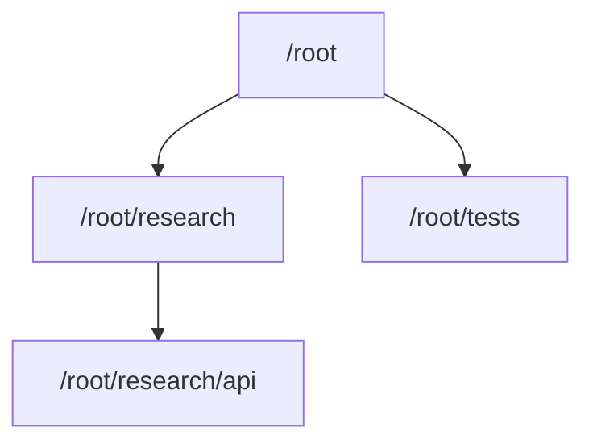

Codex `0.145.0` став першим релізом, у якому мені справді захотілося всерйоз
випробувати Agents V2. OpenAI тепер позначає прапорець `multi_agent_v2` як
`stable`, але за замовчуванням залишає його вимкненим. Якщо ввімкнути прапорець
явно, Codex примусово перейде на V2. До релізу також увійшли зміни в керуванні
паралельністю, виборі моделей, ролях і навігації.
<SourceLink href="https://github.com/openai/codex/pull/34383">PR #34383</SourceLink>
пояснює, як працює цей прапорець. Без явного перевизначення Codex усе одно може
вибрати бекенд за метаданими моделі. У каталозі моделей для цього тегу GPT-5.6 Sol
і Terra вибирають V2, а Luna вибирає V1.
<SourceLink href="https://github.com/openai/codex/blob/rust-v0.145.0/codex-rs/models-manager/models.json">Каталог моделей для цього тегу</SourceLink>
та
<SourceLink href="https://github.com/openai/codex/blob/rust-v0.145.0/codex-rs/core/src/config/mod.rs#L1433-L1461">реалізація вибору бекенду</SourceLink>
показують, як Codex поєднує примусове значення прапорця з вибором, заданим для
моделі.

<Callout title="Перевірено локально" variant="note">
  Я перевірив цю статтю 22 липня 2026 року в Codex CLI `0.145.0`. На моїй машині
  `multi_agent` і `multi_agent_v2` мали статус `stable` та значення `true`, а
  інструменти V2 зі шляхами завдань працювали. Це стосується моєї конфігурації на
  ту дату й не означає, що кожна сесія Codex Desktop або CLI вже працює на V2.
</Callout>

## Коротко

- Прапорець `multi_agent_v2` має статус `stable` і за замовчуванням вимкнений.
  Якщо його ввімкнути, Codex примусово перейде на V2, хоча V2 уже може вибиратися
  за метаданими моделі.
- V2 замінює плоский список ID агентів на ієрархію завдань, якою можна
  переміщатися.
- Обсяг успадкованого контексту задається явно. Так само визначено правила роботи
  поштових скриньок батьківських і дочірніх агентів.
- У `0.145.0` оновили ролі агентів, моделі за замовчуванням, відновлення після
  перезапуску та навігацію в TUI.
- Агенти й далі працюють в одному робочому каталозі та спільній файловій системі.
  V2 допомагає координувати їх, але не ізолює в окремих worktree.
- `max_concurrent_threads_per_session = 8` дозволяє **вісім потоків агентів,
  створених у межах усього дерева сесії, плюс кореневий агент, тобто загалом
  дев’ять відкритих слотів для потоків**.

## Що змінилося порівняно з V1

Головна зміна не в кількості агентів. У V2 кожна гілка роботи має назву й місце
в дереві завдань, а правила обміну повідомленнями між гілками визначені наперед.
<SourceLink href="https://github.com/openai/codex/blob/rust-v0.145.0/codex-rs/core/src/tools/handlers/multi_agents_spec.rs">Визначення інструментів V1 і V2 для цього тегу</SourceLink>
показують різницю.

| Аспект                     | Agents V1                                                                  | Agents V2                                                                                             |
| -------------------------- | -------------------------------------------------------------------------- | ----------------------------------------------------------------------------------------------------- |
| Ідентифікатор              | Непрозорі ID агентів                                                       | Канонічні шляхи завдань, наприклад `/root/research/api`                                               |
| Контекст під час створення | `fork_context` увімкнено або вимкнено                                      | `fork_turns` приймає `none`, `all` або кількість останніх ходів                                       |
| Спілкування                | `send_input`, очікування конкретних агентів, відновлення та закриття за ID | `send_message`, `followup_task`, очікування повідомлень у скриньці, переривання та перегляд дерева    |
| Вкладеність                | Керується через `agents.max_depth`                                         | Ієрархічна вкладеність, `max_depth` ігнорується                                                       |
| Керування в TUI            | Потоки V1 приймають пряме введення                                         | Дочірні потоки V2, що належать батьківському агенту, доступні лише для перегляду                      |
| Конфігурація               | Застаріла модель плоского списку агентів                                   | Параметри під час створення, спільні типові значення та іменовані ролі, що зберігаються між запусками |

### Дерево завдань замість плоского набору

Під час кожного створення агента V2 треба вказати `task_name` у нижньому регістрі.
Codex розміщує нове завдання під агентом, який його створив, і формує канонічний
шлях. Дочірній агент може створити ще одного агента. За шляхами відразу видно
їхній зв’язок:



Такий підхід зручний для роботи з вкладеними підзадачами. Кореневий агент може
делегувати дослідження релізу, а агент, який його виконує, може передати окрему
перевірку джерел своєму дочірньому агенту. Кореневий агент усе одно може
звернутися до кожного з них за канонічним шляхом, а `list_agents` дає змогу
відфільтрувати дерево за префіксом шляху.

### Успадкування контексту задається явно

У V2 старий логічний параметр контексту замінили на `fork_turns`. Обробник
створення агента для цього тегу приймає значення у трьох формах:

```text title="Варіанти контексту під час запуску V2"
fork_turns = "all"   # уся історія, значення за замовчуванням
fork_turns = "none"  # без історії розмови
fork_turns = "5"     # п’ять останніх ходів
```

Тепер я можу підбирати обсяг контексту під конкретне завдання. Рецензенту може
знадобитися недавнє обговорення дизайну, а агенту, який досліджує репозиторій,
часом вистачить точно сформульованого завдання. Парсер і типове значення можна
побачити в
<SourceLink href="https://github.com/openai/codex/blob/rust-v0.145.0/codex-rs/core/src/tools/handlers/multi_agents_v2/spawn.rs">реалізації запуску V2 для цього тегу</SourceLink>.

### Повідомлення і додаткова робота розділені

Дві операції з повідомленнями працюють по-різному:

- `send_message` передає інформацію, не починаючи нового ходу агента.
- `followup_task` дає вже створеному агенту додаткову роботу й запускає хід, коли
  той не зайнятий.

Так інформацію можна передати, не оформлюючи її як нове завдання. Очікування
враховує повідомлення у поштовій скриньці. Агентів також можна переривати й
переглядати за шляхом завдання.
<SourceLink href="https://github.com/openai/codex/blob/rust-v0.145.0/codex-rs/core/src/tools/handlers/multi_agents_spec.rs">Схема інструментів для спільної роботи в цій версії</SourceLink>
описує цю поведінку.

### Ролі зберігаються під час відновлення після перезапуску

У V2 іменовані ролі стали практичнішими. Роль може містити опис для користувача,
окремий шар конфігурації та варіанти псевдонімів:

```toml title="~/.codex/config.toml"
[agents.researcher]
description = "Audit primary sources and report evidence with links."
config_file = "./agents/researcher.toml"
nickname_candidates = ["Ada", "Grace"]
```

Відносні шляхи до файлів ролей обчислюються від розташування `config.toml`, у якому
їх визначено. У `0.145.0` під час відновлення після перезапуску зберігається й
конфігурація вибраної ролі, коли агент V2 зі збереженим станом завантажується
знову.
Інтеграційний тест перевіряє інструкції ролі, модель, провайдера, рівень міркування
та дозволи.
<SourceLink href="https://github.com/openai/codex/pull/33657">PR #33657</SourceLink>
описує це виправлення.

### Дочірні потоки навмисно доступні лише для читання

У TUI я можу відкрити й переглянути дочірній потік V2, що належить батьківському
агенту, але не можу вводити текст безпосередньо. Спілкуватися з дочірнім потоком
треба через батьківського агента за допомогою інструментів V2. Це закладене правило
власності, а не недоробка поля введення. Поки потік відкритий для перегляду,
чернетки й текст у черзі зберігаються.
<SourceLink href="https://github.com/openai/codex/pull/33841">PR #33841</SourceLink>
містить обґрунтування та тести, які перевіряють введення у V1 і режим лише для
перегляду у V2.

## Як увімкнути Agents V2

Щоб примусово використовувати V2, достатньо одного прапорця:

```toml title="~/.codex/config.toml"
[features]
multi_agent_v2 = true
```

Команда CLI записує те саме значення:

```sh title="Увімкнути Agents V2"
codex features enable multi_agent_v2
```

Після зміни вибору бекенду я відкриваю нове завдання й перевіряю результат уже в
ньому. Видалений прапорець сумісності `multi_agent_mode` я не використовую, бо в
цьому релізі він нічого не робить.

### Моя робоча конфігурація

Я використовую таку конфігурацію:

```toml title="~/.codex/config.toml"
[agents]
enabled = true
max_concurrent_threads_per_session = 8

[features]
multi_agent_v2 = true
```

`agents.enabled = true` вказано явно, хоча цей рядок зайвий. За схемою конфігурації
інструменти для роботи з кількома агентами увімкнені за замовчуванням, а активний
прапорець V2 має пріоритет. Я також не задаю `default_subagent_model` або
`default_subagent_reasoning_effort`, тому конфігурація не прив’язує всіх створених
агентів до певної моделі чи рівня міркування. Ці необов’язкові типові значення
застосовуються лише тоді, коли під час створення агента для них не вказано інших
значень.
<SourceLink href="https://github.com/openai/codex/blob/rust-v0.145.0/codex-rs/core/config.schema.json">Схема конфігурації для цього тегу</SourceLink>
визначає ці поля.

<Callout title="Вісім означає вісім створених агентів" variant="warning">
  У секції `[agents]` параметр `max_concurrent_threads_per_session` враховує потоки
  створених агентів, що залишаються відкритими в усьому дереві сесії. Значення `8`
  дозволяє вісім таких потоків плюс кореневий агент, тобто загалом дев’ять відкритих
  слотів. Параметр лише обмежує паралельність і не змушує Codex заповнювати всі
  слоти.
</Callout>

У тій самій схемі старий параметр `max_depth` позначено як доступний лише у V1,
а V2 його ігнорує. Тому розгалуження V2 я контролюю через ліміт паралельності та
чіткі межі завдань.

### Як перевірити фактичний стан

Я одночасно перевіряю встановлену версію та потрібні рядки у списку можливостей:

```sh title="Перевірити версію Codex і стан можливостей"
codex --version
codex features list
```

22 липня 2026 року відповідна частина виводу мала такий вигляд:

```text title="Відповідна частина локального виводу"
codex-cli 0.145.0
multi_agent       stable  true
multi_agent_v2    stable  true
multi_agent_mode  removed false
```

Доступні інструменти дають ще один спосіб перевірити стан під час роботи.
`spawn_agent` потребує `task_name`, а в сесії є `send_message`, `followup_task`,
`list_agents` та `interrupt_agent`. Список можливостей показує налаштовані
прапорці, а набір інструментів показує, чим може користуватися активне завдання.

## Рівні міркування High і Ultra

Agents V2 працює і з High, і з Ultra. Різниця в тому, коли Codex делегує роботу.
З High я явно прошу залучити паралельних агентів. Ultra дозволяє Codex делегувати
проактивно, хоча невелике або тісно пов’язане завдання він усе одно може залишити
одному агенту.

Старий параметр `multiAgentMode` застарів та ігнорується. У документації
app-server для цього тегу прямо сказано, що проактивне делегування вмикає саме
рівень міркування Ultra.
<SourceLink href="https://github.com/openai/codex/blob/rust-v0.145.0/codex-rs/app-server/README.md">Довідник протоколу app-server</SourceLink>
описує це безпосередньо.

З High достатньо такого запиту:

```text title="Явне делегування з High"
Використовуй Agents V2 там, де роботу можна виконувати незалежно. Делегуй
дослідження джерел, реалізацію та перевірку, а потім об’єднай результат у
кореневому завданні.
```

Ultra може делегувати проактивно, але не зобов’язаний цього робити. Налаштування
паралельності лише обмежує кількість відкритих потоків і не визначає, скільки з
них Codex має використати. Чіткі межі завдань важливіші за ліміт у шість чи вісім
потоків.

## Обмеження спільного робочого простору

Агенти V2 мають спільний робочий простір, а не окремі worktree. У вбудованих
інструкціях прямо сказано, що всі агенти працюють в одному контейнері, файловій
системі та поточному робочому каталозі й одразу бачать зміни одне одного.
<SourceLink href="https://github.com/openai/codex/blob/rust-v0.145.0/codex-rs/core/src/config/mod.rs">Реалізація конфігурації для цього тегу</SourceLink>
містить ці інструкції.

<Callout title="Координуйте агентів, які редагують файли" variant="warning">
  Зміни двох агентів, які редагують той самий файл, можуть конфліктувати. Я делегую
  агентам різні файли або дослідження без редагування файлів. Кожну зону редагування
  закріплюю за одним агентом, а остаточне об’єднання та загальну перевірку залишаю
  кореневому агенту.
</Callout>

Я сприймаю Agents V2 насамперед як покращення оркестрації. За паралельною роботою
простіше стежити завдяки шляхам завдань, вибору обсягу контексту, поштовим
скринькам і ролям, що зберігаються між запусками. Та ділити роботу все одно треба
так, щоб агенти не заважали одне одному.

## Чи варто вмикати V2

Для масштабної роботи з репозиторієм так. У `0.145.0` можливість уже має статус
`stable`, а супутніх змін достатньо, щоб випробувати її як слід. Найбільше мені
подобається явне дерево завдань. Корисно й те, що можна вибрати, скільки історії
отримає кожен дочірній агент, і відокремити звичайне повідомлення від нового
завдання.

Сама архітектура нічого не доводить про швидкість, вартість чи якість. Це треба
вимірювати на реальних завданнях. Я також не запускав би агентів лише заради того,
щоб заповнити вісім слотів. Для невеликої зміни часто краще вибрати одного
кореневого агента. Коли дослідження, реалізація, тести й перевірка можуть іти
незалежно, V2 дає їм значно зрозумілішу систему координації.

Поки що моя мінімальна конфігурація працює без проблем. Коли хочу примусово
використовувати V2, я вмикаю прапорець, відкриваю нове завдання й перевіряю
доступні інструменти. Ліміт паралельності підвищую лише тоді, коли можу чітко
розмежувати частини роботи.

## Джерела

- <SourceLink href="https://github.com/openai/codex/releases/tag/rust-v0.145.0">Примітки до релізу Codex 0.145.0</SourceLink>
- <SourceLink href="https://github.com/openai/codex/pull/34383">PR #34383: надати multi-agent V2 статус stable</SourceLink>
- <SourceLink href="https://github.com/openai/codex/blob/rust-v0.145.0/codex-rs/features/src/lib.rs">Реєстр можливостей для цього тегу</SourceLink>
- <SourceLink href="https://github.com/openai/codex/blob/rust-v0.145.0/codex-rs/core/config.schema.json">Схема конфігурації для цього тегу</SourceLink>
- <SourceLink href="https://github.com/openai/codex/blob/rust-v0.145.0/codex-rs/core/src/config/mod.rs">Вибір бекенду та інструкції V2 для цього тегу</SourceLink>
- <SourceLink href="https://github.com/openai/codex/blob/rust-v0.145.0/codex-rs/core/src/tools/handlers/multi_agents_spec.rs">Визначення інструментів V1 і V2 для цього тегу</SourceLink>
- <SourceLink href="https://github.com/openai/codex/blob/rust-v0.145.0/codex-rs/core/src/tools/handlers/multi_agents_v2/spawn.rs">Реалізація створення агентів V2 та успадкування контексту для цього тегу</SourceLink>
- <SourceLink href="https://github.com/openai/codex/pull/33550">PR #33550: об’єднати налаштування кількох агентів у секції `agents`</SourceLink>
- <SourceLink href="https://github.com/openai/codex/pull/33631">PR #33631: врахувати налаштовані моделі за замовчуванням</SourceLink>
- <SourceLink href="https://github.com/openai/codex/pull/33657">PR #33657: відновлювати ролі під час повторного завантаження агентів V2</SourceLink>
- <SourceLink href="https://github.com/openai/codex/pull/33841">PR #33841: зробити дочірні потоки V2, якими керує батьківський агент, доступними лише для читання</SourceLink>
- <SourceLink href="https://github.com/openai/codex/blob/rust-v0.145.0/codex-rs/app-server/README.md">Довідник протоколу app-server для цього тегу</SourceLink>
