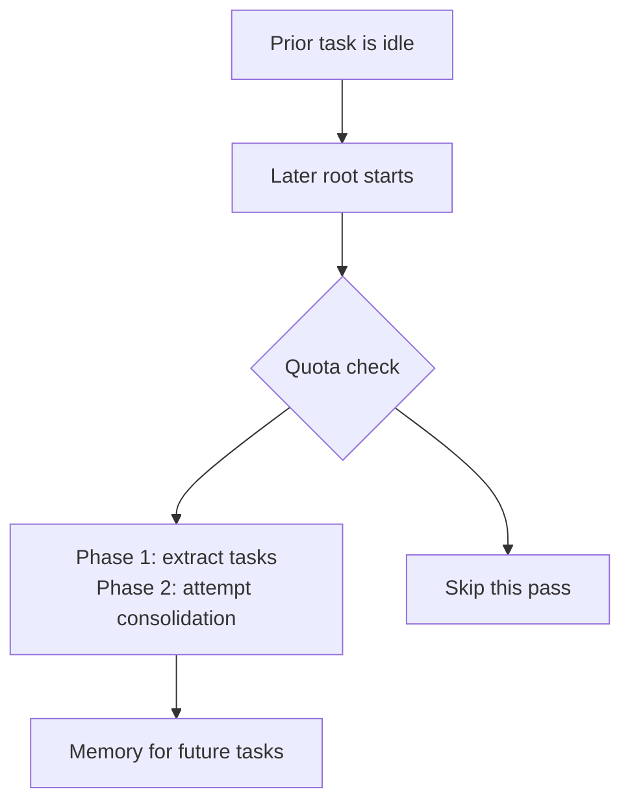

I used <SourceLink href="https://cmem.ai/">`claude-mem`</SourceLink> because it removed a dull ritual from coding sessions:
explaining the last session before starting the next one. Its hooks made memory
feel immediate. I liked that continuity, but I did not like keeping a Claude
subscription in the loop when most of my work now happens in Codex through my
ChatGPT plan.

Codex Memories is not a drop-in replacement. It does not save an observation
after every turn. It waits for an earlier task to become idle, extracts useful
material during a later root-session startup, then attempts to consolidate that
material into local Markdown. That slower rhythm changed how I use memory. It
handles recall, while `AGENTS.md` and checked-in documentation still hold rules
that must always apply.
<SourceLink href="https://learn.chatgpt.com/docs/customization/memories">OpenAI's Memories documentation</SourceLink>
draws the same boundary, and the
<SourceLink href="https://github.com/openai/codex/blob/rust-v0.145.0/codex-rs/memories/README.md">tagged pipeline documentation</SourceLink>
describes the two background phases.

<Callout title="Verified locally" variant="note">
  I verified this article on July 23, 2026 with Codex CLI `0.145.0`. The
  `memories` feature reported `stable` and `true`. In this task I used the native
  `memories.list`, `memories.search`, and `memories.read` tools against my local
  store. The values and source links below describe that version on that date.
</Callout>

## The short version

- ChatGPT web memory and local Codex memory are separate stores.
- Codex extracts memory from eligible prior tasks in the background. It does not
  run a `claude-mem`-style observation hook after every turn.
- My settings favor coverage across tool-heavy sessions and projects I revisit
  after a few weeks.
- `dedicated_tools = true` exposes native memory tools. It is not MCP and does
  not start another server.
- Memories help with recall. Required repository rules still belong in
  `AGENTS.md` or project documentation.
- I pin the scheduling values because the defaults in the current documentation
  do not all match the tagged `0.145.0` source.

## How the local memory pipeline works

In Codex, a rollout is a saved task or thread, not an individual message. The
memory pipeline starts asynchronously when a later root session starts:



Phase 1 selects recent tasks that have been idle long enough and have not already
been claimed by another worker. For each useful task, the model produces a
detailed raw memory, a compact rollout summary, and optionally a short slug. Codex
redacts secrets from those generated fields and saves the result in its state
database.

Phase 2 selects eligible outputs ranked by prior use and recency, then refreshes
the files under `$CODEX_HOME/memories/`, which is `~/.codex/memories/` by default.
On my machine the main workspace currently contains `MEMORY.md`,
`memory_summary.md`, `raw_memories.md`, `rollout_summaries/`, and `skills/`. Codex
treats that directory as generated state. I inspect it when I need to understand
a recall, but I do not hand-edit it as my normal memory workflow.

Consolidation does not necessarily follow every successful extraction
immediately. Phase 2 has its own coordination, retry, and cooldown checks, so a
startup can finish Phase 1 and skip consolidation.
<SourceLink href="https://github.com/openai/codex/blob/rust-v0.145.0/codex-rs/memories/write/src/phase2.rs">The tagged Phase 2 implementation</SourceLink>
contains those checks.

I kept the tagged six-hour idle default. It lets memories become eligible sooner,
although the source recommends more than 12 hours when avoiding premature
extraction matters more. Memory from a finished session may still be unavailable
in the next session I open five minutes later.

## My exact configuration

This is the memory section in my global `~/.codex/config.toml`:

```toml title="~/.codex/config.toml"
[features]
memories = true

[memories]
generate_memories = true
use_memories = true
dedicated_tools = true
disable_on_external_context = false
min_rate_limit_remaining_percent = 10
min_rollout_idle_hours = 6
max_rollout_age_days = 30
max_rollouts_per_startup = 8
max_unused_days = 90
```

The feature flag turns the system on. `generate_memories` allows new tasks to
become inputs for later extraction, while `use_memories` allows Codex to inject
existing memory into future tasks. I keep both lines explicit even though they
default to `true` in `0.145.0`.

I leave `extract_model` and `consolidation_model` unset. Codex can choose the
models intended for those jobs, and I have no measurement showing that an
override would improve my memories.

### Defaults versus my values

| Setting                            | `0.145.0` default | Mine    | Why I set it                                             |
| ---------------------------------- | ----------------- | ------- | -------------------------------------------------------- |
| `dedicated_tools`                  | `false`           | `true`  | Expose native list, search, read, and note tools         |
| `disable_on_external_context`      | `false`           | `false` | Keep MCP, web, and tool-search sessions eligible         |
| `min_rate_limit_remaining_percent` | `25`              | `10`    | Skip fewer background passes when quota is still usable  |
| `min_rollout_idle_hours`           | `6`               | `6`     | Keep the tagged default and accept earlier extraction    |
| `max_rollout_age_days`             | `10`              | `30`    | Give an unprocessed task more time to enter the pipeline |
| `max_rollouts_per_startup`         | `2`               | `8`     | Allow up to eight claims during one startup pass         |
| `max_unused_days`                  | `30`              | `90`    | Retain context for projects I revisit monthly            |

The
<SourceLink href="https://github.com/openai/codex/blob/rust-v0.145.0/codex-rs/config/src/types.rs">tagged `0.145.0` configuration source</SourceLink>
defines those defaults. The
<SourceLink href="https://learn.chatgpt.com/docs/config-file/config-reference">current configuration reference</SourceLink>
now says `30` days and `16` rollouts for two of the same fields, rather than
`10` and `2`. I treat defaults as versioned behavior and pin the values that
matter to me. If I upgrade Codex, I check the installed version and the current
reference again.

## Why I changed the scheduling knobs

The idle and age settings define the candidate window. With my configuration, a
task can be picked up when it is at least six hours idle and no more than 30 days
old. `max_rollouts_per_startup` then limits Codex to eight claimed candidates
during that startup pass.

Suppose I finish task A at 10:00. A new root task at noon will not select it for
extraction because only two hours have passed. If I start another root task at
17:00, task A is old enough to qualify. If eight newer eligible tasks are already
ahead of it, a later startup can pick it up, provided it has not aged beyond 30
days.

Raising `max_rollouts_per_startup` from `2` to `8` raises the throughput ceiling,
not prompt size. Codex does not inject eight complete transcripts into every
task. It can process up to eight prior rollout candidates in that background
pass.

`max_unused_days = 90` controls how long a Stage 1 output stays eligible after a
cited use. If it has never been used, `0.145.0` falls back to the source task's
last update time. The same setting lets startup prune stale, unselected database
rows. It is not a direct time-to-live for the generated Markdown files. The
longer window fits how I switch between projects, but it can also preserve an old
decision for longer.
<SourceLink href="https://github.com/openai/codex/blob/rust-v0.145.0/codex-rs/state/src/runtime/memories.rs">The tagged memory runtime</SourceLink>
contains those selection and pruning rules.

Memory is a lead to check, not proof that the remembered state is still current.

### The quota check is best effort

`min_rate_limit_remaining_percent = 10` does not reserve 10 percent of my quota.
When Codex obtains a backend rate-limit snapshot, every reported primary or
secondary window must clear the threshold before the memory pass starts. If the
snapshot check itself fails, `0.145.0` allows startup to continue.
<SourceLink href="https://github.com/openai/codex/blob/rust-v0.145.0/codex-rs/memories/write/src/guard.rs">The tagged rate-limit guard</SourceLink>
shows that check.

I lowered the default from `25` because I would rather process more sessions
while my Codex allowance is healthy. It does not guarantee that the same amount
remains after extraction and consolidation finish.

### Tool-heavy sessions stay eligible

Most of my useful coding tasks use MCP, web search, or tool search. With
`disable_on_external_context = false`, those tasks can still contribute to
memory. Setting it to `true` marks the whole task polluted and keeps it out of
memory generation rather than filtering only the external snippets.
<SourceLink href="https://github.com/openai/codex/blob/rust-v0.145.0/codex-rs/core/src/stream_events_utils.rs">The tagged external-context handling</SourceLink>
shows that thread-level behavior.

I keep the global value `false` and use `/memories` for exceptions. If a task is
sensitive, noisy, or disposable, I can prevent that task from becoming memory
input without discarding every tool-heavy session.

This setting has a privacy cost. External tool output can influence the generated
memory. OpenAI says generated memory fields are secret-redacted, but also warns
users not to put secrets in memory and to review the local files before sharing
them.

## What enabling dedicated tools changes

With the `memories` feature and `use_memories` enabled, `dedicated_tools = true`
adds four tools to Codex's native extension surface:

| Tool                       | What I use it for                                      |
| -------------------------- | ------------------------------------------------------ |
| `memories.list`            | Browse the local memory workspace                      |
| `memories.search`          | Find substring matches across memory files             |
| `memories.read`            | Read the relevant file or line range                   |
| `memories.add_ad_hoc_note` | Record an explicit remember, update, or forget request |

The
<SourceLink href="https://github.com/openai/codex/blob/rust-v0.145.0/codex-rs/ext/memories/src/tools/mod.rs">tagged memory-tool registry</SourceLink>
defines all four. They are local, namespaced Codex tools, not MCP tools. I do not
install a server or manage another process.

Normally I ask in plain language:

```text title="Recall prior work"
Search your memories for the Vercel deployment issue we solved,
then read the most relevant result.
```

For an explicit update:

```text title="Add a durable note"
Remember that this repository validates MDX with bun run mdx:check.
```

The tool description tells Codex to use this operation only after an explicit
request to remember, update, or forget something. The handler requires a
timestamp-shaped Markdown filename and refuses to overwrite an existing file. It
does not rewrite `MEMORY.md` in place. A later consolidation pass can incorporate
the note.
<SourceLink href="https://github.com/openai/codex/blob/rust-v0.145.0/codex-rs/ext/memories/src/tools/ad_hoc_note.rs">The tagged note-tool implementation</SourceLink>
defines the agent-facing instruction, while the
<SourceLink href="https://github.com/openai/codex/blob/rust-v0.145.0/codex-rs/ext/memories/src/local/ad_hoc_note.rs">local note backend</SourceLink>
enforces new-file creation.

This flag is still underdocumented. It is present in the `0.145.0` configuration
type and works in my installed build, but the public configuration reference did
not list it on July 23, 2026. I would recheck it after an upgrade rather than
treat it as a permanent contract.

## Where memory fits in my workflow

I get better results when each kind of context has one home:

| Layer                        | What belongs there                                                          |
| ---------------------------- | --------------------------------------------------------------------------- |
| `AGENTS.md` and project docs | Required commands, conventions, architecture, and review rules              |
| Codex Memories               | Prior decisions, useful evidence, failures, preferences, and task history   |
| Skills                       | Repeatable workflows such as research, review, or prose editing             |
| MCP, apps, and live tools    | Current external state from GitHub, calendars, deployment systems, and docs |
| Fresh verification           | Versions, runtime output, repository state, and other facts that can drift  |

This separation makes it harder to mistake a remembered preference for a
repository rule, or an old deployment result for current state.

At the start of a task, I let the injected memory summary provide broad context.
If the request depends on an earlier decision, I ask Codex to search and read the
supporting memory instead of guessing from the summary. During ordinary work, I
do not create a note after every turn. The background extractor is better suited
to that volume.

I use an explicit note for the small set of facts that should survive even if a
session summary misses them: a personal preference, a recurring failure, or an
updated decision. Hard project requirements go into the repository instead.

## What this improves, and what it does not

While writing this post, the injected memory brought back the Blog's earlier
Humanizer workflow and bilingual parity rules. Repository inspection then
surfaced a route-specific end-to-end test that would fail when the new article
became featured. That is exactly the recap I wanted to skip. The local Markdown
also let me inspect the evidence instead of trusting a vague summary.

I still give up the fine-grained observation timeline I had with `claude-mem`.
Codex memory can arrive hours later, the dedicated search is substring-based, and
a 90-day consolidation window can bring back stale context. ChatGPT web memory
also remains separate, so this is not one universal memory across every OpenAI
surface.

I am not ready to claim a productivity percentage from this setup. My current
test is simpler: do I spend less time reconstructing decisions, and does Codex
avoid repeating failures it already solved? If old context becomes noisy, I will
lower `max_unused_days` to `60` before adding another memory system.

## Sources

- <SourceLink href="https://learn.chatgpt.com/docs/customization/memories">OpenAI: Memories</SourceLink>
- <SourceLink href="https://learn.chatgpt.com/docs/config-file/config-reference">OpenAI: Codex configuration reference</SourceLink>
- <SourceLink href="https://github.com/openai/codex/blob/rust-v0.145.0/codex-rs/config/src/types.rs">Codex `0.145.0` memory settings and defaults</SourceLink>
- <SourceLink href="https://github.com/openai/codex/blob/rust-v0.145.0/codex-rs/memories/README.md">Codex `0.145.0` memory pipeline documentation</SourceLink>
- <SourceLink href="https://github.com/openai/codex/blob/rust-v0.145.0/codex-rs/state/src/runtime/memories.rs">Codex `0.145.0` memory runtime</SourceLink>
- <SourceLink href="https://github.com/openai/codex/blob/rust-v0.145.0/codex-rs/memories/write/src/phase2.rs">Codex `0.145.0` consolidation implementation</SourceLink>
- <SourceLink href="https://github.com/openai/codex/blob/rust-v0.145.0/codex-rs/memories/write/src/guard.rs">Codex `0.145.0` rate-limit guard</SourceLink>
- <SourceLink href="https://github.com/openai/codex/blob/rust-v0.145.0/codex-rs/core/src/stream_events_utils.rs">Codex `0.145.0` external-context handling</SourceLink>
- <SourceLink href="https://github.com/openai/codex/blob/rust-v0.145.0/codex-rs/ext/memories/src/tools/mod.rs">Codex `0.145.0` memory-tool registry</SourceLink>
- <SourceLink href="https://github.com/openai/codex/blob/rust-v0.145.0/codex-rs/ext/memories/src/tools/search.rs">Codex `0.145.0` substring-search tool</SourceLink>
- <SourceLink href="https://github.com/openai/codex/blob/rust-v0.145.0/codex-rs/ext/memories/src/tools/ad_hoc_note.rs">Codex `0.145.0` ad-hoc note tool</SourceLink>
- <SourceLink href="https://github.com/openai/codex/blob/rust-v0.145.0/codex-rs/ext/memories/src/local/ad_hoc_note.rs">Codex `0.145.0` local note backend</SourceLink>
- <SourceLink href="https://github.com/thedotmack/claude-mem">`claude-mem` repository</SourceLink>
