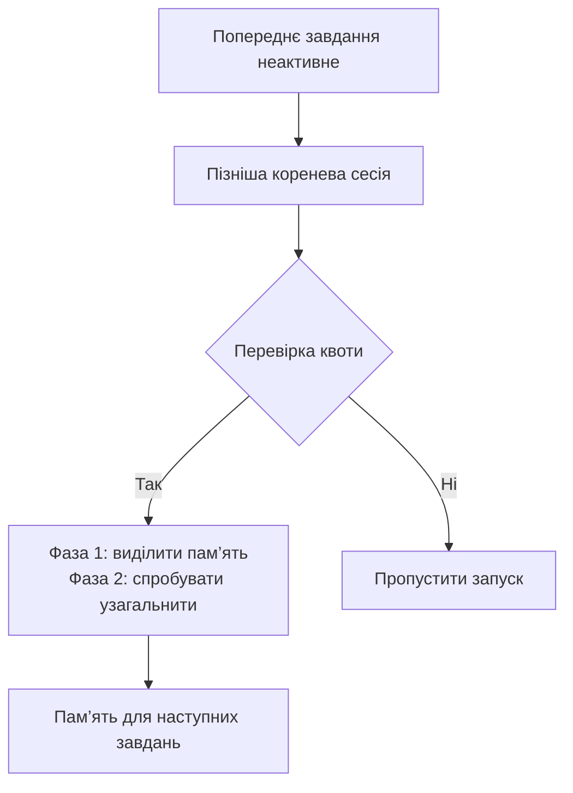

Я користувався <SourceLink href="https://cmem.ai/">`claude-mem`</SourceLink>, бо він прибрав нудний ритуал із роботи над кодом:
на початку кожної сесії переказувати, чим закінчилася попередня. Хуки давали
відчуття, що пам’ять спрацьовує одразу. Такий зв’язок між сесіями мені подобався,
але не подобалося тримати підписку на Claude в цьому ланцюжку, коли більшість
роботи я вже виконую в Codex у межах свого плану ChatGPT.

Codex Memories не є прямою заміною. Система не записує нове спостереження після
кожного повідомлення. Вона чекає, поки в попередньому завданні мине певний час без
активності. Коли згодом запускається інша коренева сесія, Codex дістає з нього
корисне, а потім намагається узагальнити цей матеріал у локальних Markdown-файлах.
Цей повільніший ритм змінив те, як я використовую пам’ять. Вона допомагає згадати
попередню роботу, а правила, яких треба дотримуватися завжди, залишаються в
`AGENTS.md` і документації репозиторію.
<SourceLink href="https://learn.chatgpt.com/docs/customization/memories">Документація OpenAI про Memories</SourceLink>
так само розмежовує ці ролі, а
<SourceLink href="https://github.com/openai/codex/blob/rust-v0.145.0/codex-rs/memories/README.md">опис конвеєра для цього тегу</SourceLink>
пояснює дві фонові фази.

<Callout title="Перевірено локально" variant="note">
  Я перевірив цю статтю 23 липня 2026 року в Codex CLI `0.145.0`. Функція
  `memories` мала статус `stable` і значення `true`. У цьому завданні я працював
  зі своїм локальним сховищем через вбудовані інструменти `memories.list`,
  `memories.search` і `memories.read`. Значення та посилання на джерела нижче
  стосуються цієї версії станом на ту дату.
</Callout>

## Коротко

- Пам’ять у ChatGPT Web і локальна пам’ять Codex зберігаються окремо.
- Codex у фоновому режимі виділяє пам’ять із попередніх завдань, що відповідають
  умовам. Після кожного повідомлення він не запускає хук спостережень, як це робить
  `claude-mem`.
- Мої налаштування допомагають не втрачати сесії з активним використанням
  інструментів і контекст проєктів, до яких я повертаюся за кілька тижнів.
- `dedicated_tools = true` додає вбудовані інструменти пам’яті. Це не MCP, і
  окремий сервер не запускається.
- Memories допомагає згадати попередню роботу. Обов’язкові правила репозиторію
  все одно мають бути в `AGENTS.md` або документації проєкту.
- Я задаю параметри планування явно, бо не всі типові значення в актуальній
  документації збігаються з кодом тегу `0.145.0`.

## Як працює локальний конвеєр пам’яті

У Codex rollout означає збережене завдання або сеанс, а не окреме повідомлення.
Конвеєр пам’яті запускається асинхронно, коли згодом починається нова коренева
сесія:



У першій фазі Codex вибирає нещодавні завдання, які достатньо довго не мали
активності й які ще не взяв в обробку інший воркер. Для кожного корисного завдання
модель створює докладний запис пам’яті, короткий підсумок сеансу й, за потреби,
короткий slug. Codex маскує секрети у згенерованих полях і записує результат у
базу даних стану.

У другій фазі Codex вибирає придатні результати, впорядковані за частотою
попереднього використання та часом останнього оновлення. Потім він оновлює файли в
`$CODEX_HOME/memories/`, що за замовчуванням відповідає
`~/.codex/memories/`. На моїй машині основне сховище зараз містить `MEMORY.md`,
`memory_summary.md`, `raw_memories.md`, `rollout_summaries/` і `skills/`. Codex
зберігає в цьому каталозі згенерований стан. Я переглядаю його, коли хочу
зрозуміти, звідки Codex узяв певний контекст, але зазвичай не редагую вручну.

Успішне завершення першої фази не означає, що друга запуститься одразу. У другої
фази є окремі перевірки координації, повторних спроб і періоду очікування після
недавнього успішного запуску. Тому Codex може завершити першу фазу й пропустити
узагальнення.
<SourceLink href="https://github.com/openai/codex/blob/rust-v0.145.0/codex-rs/memories/write/src/phase2.rs">Реалізація другої фази для цього тегу</SourceLink>
містить ці перевірки.

`min_rollout_idle_hours = 6`, типове значення для цього тегу, я не змінював. Так
завдання раніше стають придатними для виділення пам’яті, хоча в коментарі до коду
радять понад 12 годин, якщо важливіше уникнути передчасного виділення. Контекст із
завершеної сесії може бути недоступний у наступній, якщо я відкрию її за п’ять
хвилин.

## Моя конфігурація

Ось розділ пам’яті з мого глобального `~/.codex/config.toml`:

```toml title="~/.codex/config.toml"
[features]
memories = true

[memories]
generate_memories = true
use_memories = true
dedicated_tools = true
disable_on_external_context = false
min_rate_limit_remaining_percent = 10
min_rollout_idle_hours = 6
max_rollout_age_days = 30
max_rollouts_per_startup = 8
max_unused_days = 90
```

Прапорець `memories` вмикає всю систему. `generate_memories` дозволяє
використовувати нові завдання як матеріал для подальшого виділення пам’яті, а
`use_memories` дозволяє Codex додавати наявну пам’ять до контексту майбутніх
завдань. Я явно прописую обидва параметри, хоча у версії `0.145.0` для обох
типовим є `true`.

`extract_model` і `consolidation_model` я не задаю. Codex може сам вибрати моделі
для цих операцій. У мене немає даних, що ручний вибір покращив би пам’ять.

### Типові та мої значення

| Налаштування                       | Типове в `0.145.0` | Моє     | Навіщо я його задаю                                               |
| ---------------------------------- | ------------------ | ------- | ----------------------------------------------------------------- |
| `dedicated_tools`                  | `false`            | `true`  | Додати вбудовані інструменти перегляду, пошуку, читання й нотаток |
| `disable_on_external_context`      | `false`            | `false` | Не відкидати сесії з MCP, вебпошуком і пошуком інструментів       |
| `min_rate_limit_remaining_percent` | `25`               | `10`    | Рідше пропускати фонову обробку, поки запас квоти ще достатній    |
| `min_rollout_idle_hours`           | `6`                | `6`     | Зберегти типове значення для раннішого виділення пам’яті          |
| `max_rollout_age_days`             | `10`               | `30`    | Дати необробленому завданню більше часу потрапити в конвеєр       |
| `max_rollouts_per_startup`         | `2`                | `8`     | Дозволити до восьми закріплень за один фоновий запуск             |
| `max_unused_days`                  | `30`               | `90`    | Зберігати контекст проєктів, до яких я повертаюся щомісяця        |

Ці типові значення визначено у
<SourceLink href="https://github.com/openai/codex/blob/rust-v0.145.0/codex-rs/config/src/types.rs">коді конфігурації для тегу `0.145.0`</SourceLink>.
Водночас
<SourceLink href="https://learn.chatgpt.com/docs/config-file/config-reference">актуальний довідник конфігурації</SourceLink>
тепер вказує `30` днів і `16` сеансів для двох тих самих полів замість `10` і
`2`. Типові значення залежать від версії, тому я явно задаю ті, від яких залежить
моя робота. Якщо я оновлю Codex, знову перевірю встановлену версію й актуальний
довідник.

## Навіщо я змінив параметри планування

Мінімальний час без активності та максимальний вік визначають вікно кандидатів.
За моєї конфігурації завдання може пройти відбір, якщо воно неактивне щонайменше
шість годин і не старше за 30 днів. Потім `max_rollouts_per_startup` обмежує
кількість кандидатів, які Codex бере в роботу за один запуск, до восьми.

Припустімо, я завершив завдання A о 10:00. Нова коренева сесія опівдні ще не
вибере його для виділення пам’яті, бо минуло лише дві години. Якщо я почну ще одну
кореневу сесію о 17:00, завдання A вже відповідатиме часовій умові. Якщо перед ним
буде вісім новіших кандидатів, його зможе підхопити пізніший запуск, якщо на той
час воно не вийде за 30-денне вікно.

Збільшення `max_rollouts_per_startup` з `2` до `8` підвищує межу пропускної
здатності, а не розмір промпту. Codex не додає в кожне завдання вісім повних
транскриптів. Він може обробити до восьми попередніх кандидатів під час цього
фонового запуску.

`max_unused_days = 90` визначає, скільки часу результат першої фази залишається
придатним після використання, підтвердженого цитуванням. Якщо запис ще не
використовували, версія `0.145.0` відлічує цей строк від останнього оновлення
завдання, з якого походить запис. Той самий параметр дозволяє під час запуску
прибирати застарілі невибрані рядки з бази даних. Це не прямий TTL для згенерованих
Markdown-файлів. Довше вікно краще відповідає тому, як я перемикаюся між
проєктами, але старе рішення теж може зберігатися довше.
<SourceLink href="https://github.com/openai/codex/blob/rust-v0.145.0/codex-rs/state/src/runtime/memories.rs">Реалізація пам’яті для цього тегу</SourceLink>
містить ці правила відбору й очищення.

Пам’ять дає зачіпку для перевірки, а не доказ актуальності стану.

### Перевірка квоти працює за можливості

`min_rate_limit_remaining_percent = 10` не резервує десять відсотків моєї квоти.
Коли Codex отримує з бекенду знімок лімітів, залишок у кожному наявному основному
чи додатковому вікні не має бути нижчим за поріг. Якщо саму перевірку виконати не
вдалося, версія `0.145.0` все одно дозволяє запуску продовжитися.
<SourceLink href="https://github.com/openai/codex/blob/rust-v0.145.0/codex-rs/memories/write/src/guard.rs">Перевірка лімітів у коді цього тегу</SourceLink>
показує цю умову.

Я знизив типове значення з `25` до `10`, бо хочу, щоб Codex обробляв більше сесій,
поки ліміти це дозволяють. Налаштування не гарантує, що стільки ж залишиться після
виділення й узагальнення пам’яті.

### Сесії з інструментами теж потрапляють у пам’ять

У більшості корисних завдань із кодом я працюю з MCP, вебпошуком або пошуком
інструментів. З `disable_on_external_context = false` такі завдання все одно
можуть стати матеріалом для пам’яті. Значення `true` позначає все завдання як
`polluted` і виключає його з генерації пам’яті, а не відсіює лише зовнішні
фрагменти.
<SourceLink href="https://github.com/openai/codex/blob/rust-v0.145.0/codex-rs/core/src/stream_events_utils.rs">Обробка зовнішнього контексту для цього тегу</SourceLink>
показує, що правило діє на рівні всього завдання.

У глобальній конфігурації я залишаю `false`, а для винятків використовую
`/memories`. Якщо завдання містить чутливі дані, створює багато шуму або просто не
варте збереження, я можу заборонити використовувати саме його, не відкидаючи всі
сесії з інструментами.

Такий вибір має наслідки для приватності. Дані від зовнішніх інструментів можуть
впливати на згенеровану пам’ять. OpenAI пише, що система маскує секрети в
згенерованих полях, але водночас радить не зберігати секрети в пам’яті та
переглядати локальні файли перед тим, як ними ділитися.

## Що змінює ввімкнення окремих інструментів

Коли ввімкнено функцію `memories` і параметр `use_memories`,
`dedicated_tools = true` додає до вбудованого набору Codex чотири інструменти:

| Інструмент                 | Для чого я його використовую                               |
| -------------------------- | ---------------------------------------------------------- |
| `memories.list`            | Переглянути структуру локального сховища пам’яті           |
| `memories.search`          | Знайти текстові збіги у файлах пам’яті                     |
| `memories.read`            | Прочитати потрібний файл або діапазон рядків               |
| `memories.add_ad_hoc_note` | Записати явне прохання щось запам’ятати, оновити чи забути |

Усі чотири визначено в
<SourceLink href="https://github.com/openai/codex/blob/rust-v0.145.0/codex-rs/ext/memories/src/tools/mod.rs">реєстрі інструментів пам’яті для цього тегу</SourceLink>.
Це локальні інструменти Codex з окремим простором імен, а не MCP-інструменти. Мені
не треба встановлювати сервер або керувати ще одним процесом.

Зазвичай я формулюю запит звичайною мовою:

```text title="Згадати попередню роботу"
Знайди в пам’яті проблему з розгортанням у Vercel, яку ми вже розв’язали,
і прочитай найдоречніший результат.
```

Для явного оновлення:

```text title="Додати окрему нотатку"
Запам’ятай, що цей репозиторій перевіряє MDX командою bun run mdx:check.
```

За описом інструмента Codex має застосовувати цю операцію лише після явного
прохання щось запам’ятати, оновити або забути. Обробник вимагає назву
Markdown-файлу у форматі з часовою міткою й відмовляється створювати файл, якщо
така назва вже існує. Він не переписує `MEMORY.md` безпосередньо. Під час одного з
наступних проходів узагальнення Codex може врахувати цю нотатку.
<SourceLink href="https://github.com/openai/codex/blob/rust-v0.145.0/codex-rs/ext/memories/src/tools/ad_hoc_note.rs">Реалізація інструмента нотаток для цього тегу</SourceLink>
визначає правило для агента, а
<SourceLink href="https://github.com/openai/codex/blob/rust-v0.145.0/codex-rs/ext/memories/src/local/ad_hoc_note.rs">локальна реалізація нотаток</SourceLink>
гарантує створення нового файлу без перезапису.

Цей параметр поки погано задокументований. Він є в типі конфігурації `0.145.0` і
працює у встановленій у мене версії, але 23 липня 2026 року в публічному довіднику
конфігурації його не було. Якщо я оновлю Codex, перевірю параметр знову, а не
вважатиму його постійною гарантією.

## Яке місце пам’ять займає в моїй роботі

Я отримую кращі результати, коли для кожного виду контексту є своє місце:

| Рівень                                             | Що там має бути                                                                        |
| -------------------------------------------------- | -------------------------------------------------------------------------------------- |
| `AGENTS.md` і документація                         | Обов’язкові команди, домовленості, архітектура та правила перевірки                    |
| Codex Memories                                     | Попередні рішення, докази, помилки, уподобання та історія завдань                      |
| Skills                                             | Повторювані процеси для досліджень, рев’ю або редагування тексту                       |
| MCP, застосунки й інструменти з актуальними даними | Поточний стан у GitHub, календарях, системах розгортання та документації               |
| Перевірка поточного стану                          | Версії, вивід середовища виконання, стан репозиторію та інші дані, що можуть змінитися |

Такий поділ зменшує ризик сплутати збережене вподобання з правилом репозиторію
або давній результат розгортання з поточним станом.

На початку завдання Codex додає зведення пам’яті до контексту. Якщо запит залежить
від попереднього рішення, я прошу Codex знайти й прочитати відповідний запис, а не
вгадувати за коротким зведенням. Під час звичайної роботи я не створюю нотатку
після кожного повідомлення. Для такого обсягу краще підходить фонове виділення.

Я додаю явну нотатку лише для кількох фактів, які мають пережити сесію, навіть
якщо автоматичне зведення їх пропустить: особистого вподобання, збою, що
повторюється, або оновленого рішення. Обов’язкові вимоги проєкту натомість записую
в репозиторій.

## Що стало кращим, а що ні

Під час роботи над цією статтею пам’ять у контексті нагадала мені попередній
робочий процес Humanizer для Blog і правила відповідності англійської та
української версій. Перевірка репозиторію потім виявила e2e-тест для конкретного
маршруту. Цей тест упав би, коли нова стаття стала б головною на сторінці. Саме
такий переказ я й не хотів робити вручну. Локальний Markdown дав змогу перевірити
докази, а не довіритися нечіткому зведенню.

Водночас я втрачаю докладну хронологію спостережень, яку мав у `claude-mem`.
Пам’ять Codex може з’явитися лише за кілька годин, вбудований пошук працює за
текстовими збігами, а 90-денне вікно відбору для узагальнення може повернути
застарілий контекст. Пам’ять ChatGPT Web теж залишається окремою, тому єдиного
сховища для всіх сервісів OpenAI тут немає.

Я ще не готовий стверджувати, що ця конфігурація підвищила продуктивність на
певний відсоток. Мій критерій простіший: чи витрачаю я менше часу на відновлення
рішень і чи не повторює Codex уже виправлених помилок? Якщо старий контекст почне
заважати, зменшу `max_unused_days` до `60` перед тим як додати іншу систему
пам’яті.

## Джерела

- <SourceLink href="https://learn.chatgpt.com/docs/customization/memories">OpenAI: Memories</SourceLink>
- <SourceLink href="https://learn.chatgpt.com/docs/config-file/config-reference">OpenAI: довідник конфігурації Codex</SourceLink>
- <SourceLink href="https://github.com/openai/codex/blob/rust-v0.145.0/codex-rs/config/src/types.rs">Налаштування пам’яті й типові значення в Codex `0.145.0`</SourceLink>
- <SourceLink href="https://github.com/openai/codex/blob/rust-v0.145.0/codex-rs/memories/README.md">Опис конвеєра пам’яті в Codex `0.145.0`</SourceLink>
- <SourceLink href="https://github.com/openai/codex/blob/rust-v0.145.0/codex-rs/state/src/runtime/memories.rs">Реалізація пам’яті в Codex `0.145.0`</SourceLink>
- <SourceLink href="https://github.com/openai/codex/blob/rust-v0.145.0/codex-rs/memories/write/src/phase2.rs">Реалізація узагальнення в Codex `0.145.0`</SourceLink>
- <SourceLink href="https://github.com/openai/codex/blob/rust-v0.145.0/codex-rs/memories/write/src/guard.rs">Перевірка лімітів у Codex `0.145.0`</SourceLink>
- <SourceLink href="https://github.com/openai/codex/blob/rust-v0.145.0/codex-rs/core/src/stream_events_utils.rs">Обробка зовнішнього контексту в Codex `0.145.0`</SourceLink>
- <SourceLink href="https://github.com/openai/codex/blob/rust-v0.145.0/codex-rs/ext/memories/src/tools/mod.rs">Реєстр інструментів пам’яті в Codex `0.145.0`</SourceLink>
- <SourceLink href="https://github.com/openai/codex/blob/rust-v0.145.0/codex-rs/ext/memories/src/tools/search.rs">Інструмент пошуку текстових збігів у Codex `0.145.0`</SourceLink>
- <SourceLink href="https://github.com/openai/codex/blob/rust-v0.145.0/codex-rs/ext/memories/src/tools/ad_hoc_note.rs">Інструмент окремих нотаток у Codex `0.145.0`</SourceLink>
- <SourceLink href="https://github.com/openai/codex/blob/rust-v0.145.0/codex-rs/ext/memories/src/local/ad_hoc_note.rs">Локальна реалізація нотаток у Codex `0.145.0`</SourceLink>
- <SourceLink href="https://github.com/thedotmack/claude-mem">Репозиторій `claude-mem`</SourceLink>
