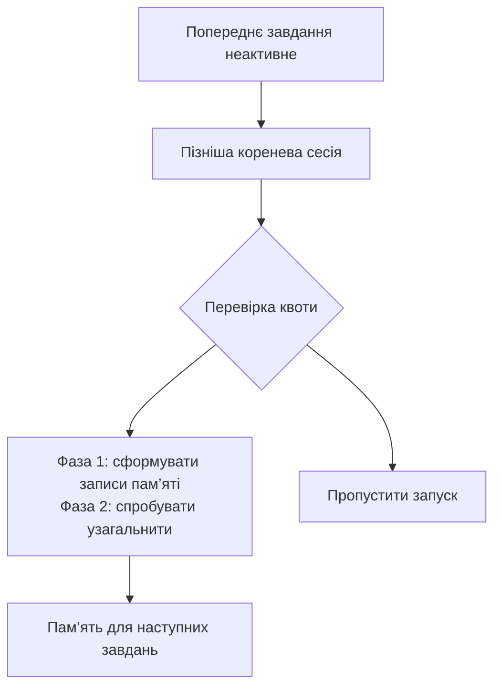

Я користувався <SourceLink href="https://cmem.ai/">`claude-mem`</SourceLink>, бо він прибрав нудний ритуал із роботи над кодом:
на початку кожної сесії переказувати, чим закінчилася попередня. Хуки давали
відчуття, що пам’ять спрацьовує одразу. Такий зв’язок між сесіями мені подобався,
але не хотілося тримати заради нього підписку Claude, коли більшість роботи я вже
виконую в Codex у межах свого плану ChatGPT.

Codex Memories не є прямою заміною `claude-mem`, бо формує нові записи рідше.
Система не створює запис пам’яті після кожного повідомлення. Вона чекає, доки
попереднє завдання певний час буде неактивним. Під час запуску наступної кореневої
сесії Codex формує з нього записи пам’яті, а згодом намагається узагальнити їх у
локальних Markdown-файлах. Я використовую цю пам’ять, щоб згадувати попередню
роботу, а обов’язкові правила зберігаю в `AGENTS.md` і документації репозиторію.
<SourceLink href="https://learn.chatgpt.com/docs/customization/memories">Документація OpenAI про Memories</SourceLink>
так само розмежовує ці ролі, а
<SourceLink href="https://github.com/openai/codex/blob/rust-v0.145.0/codex-rs/memories/README.md">опис конвеєра для цього тегу</SourceLink>
пояснює дві фонові фази.

<Callout title="Перевірено локально" variant="note">
  Я перевірив цю статтю 23 липня 2026 року в Codex CLI `0.145.0`. Функція
  `memories` мала статус `stable` і значення `true`. У цьому завданні я працював
  зі своїм локальним сховищем через вбудовані інструменти `memories.list`,
  `memories.search` і `memories.read`. Значення та посилання на джерела нижче
  стосуються цієї версії станом на ту дату.
</Callout>

## Як працює локальний конвеєр пам’яті

У Codex термін `rollout` означає збережене завдання або гілку чату, а не окреме
повідомлення. Codex запускає фоновий конвеєр пам’яті під час наступної кореневої
сесії:


```mermaid
flowchart TD
  accTitle: Конвеєр локальної пам’яті Codex
  accDescr: Попереднє завдання певний час не має активності, пізніше кореневе завдання запускає фоновий конвеєр, а Codex послідовно намагається сформувати й узагальнити записи пам’яті для майбутніх завдань.
  previous["Попереднє завдання неактивне"] --> startup["Пізніша коренева сесія"]
  startup --> gate{"Перевірка квоти"}
  gate --> pipeline["Фаза 1: сформувати записи пам’яті<br/>Фаза 2: спробувати узагальнити"]
  pipeline --> future["Пам’ять для наступних завдань"]
  gate --> skip["Пропустити запуск"]
```

У першій фазі Codex вибирає нещодавні завдання, які достатньо довго не мали
активності й які ще не взяв в обробку інший воркер. Для кожного корисного завдання
модель створює докладний запис пам’яті, короткий підсумок завдання й, за потреби,
короткий slug. Codex маскує секрети у згенерованих полях і записує результат у
базу даних стану.

У другій фазі Codex вибирає придатні результати, впорядковані за частотою
попереднього використання та часом останнього оновлення. Потім він оновлює файли в
`$CODEX_HOME/memories/`, що за замовчуванням відповідає
`~/.codex/memories/`. На моїй машині основне сховище зараз містить `MEMORY.md`,
`memory_summary.md`, `raw_memories.md`, `rollout_summaries/` і `skills/`. Вміст
цього каталогу генерує Codex. Я переглядаю його, коли хочу зрозуміти, звідки
взявся певний контекст, але не редагую вручну під час звичайної роботи.

Codex може завершити першу фазу й відкласти узагальнення. Друга фаза має окремі
перевірки координації, повторних спроб і періоду очікування після недавнього
успішного запуску.
<SourceLink href="https://github.com/openai/codex/blob/rust-v0.145.0/codex-rs/memories/write/src/phase2.rs">Реалізація другої фази для цього тегу</SourceLink>
містить ці перевірки.

Я залишив типове для цього тегу значення `min_rollout_idle_hours = 6`. З ним
записи пам’яті можуть формуватися раніше, хоча в коментарі до коду радять понад 12
годин, якщо важливіше не формувати пам’ять зарано. Контекст із завершеної сесії
може бути недоступний у наступній, якщо я відкрию її за п’ять хвилин.

## Моя конфігурація

Розділ пам’яті в моєму глобальному `~/.codex/config.toml` виглядає так:

```toml title="~/.codex/config.toml"
[features]
memories = true

[memories]
generate_memories = true
use_memories = true
dedicated_tools = true
disable_on_external_context = false
min_rate_limit_remaining_percent = 10
min_rollout_idle_hours = 6
max_rollout_age_days = 30
max_rollouts_per_startup = 8
max_unused_days = 90
```

Прапорець `memories` вмикає всю систему. `generate_memories` дозволяє Codex
формувати пам’ять із нових завдань, а `use_memories` додавати наявну пам’ять до
контексту майбутніх завдань. Я явно прописую обидва параметри, хоча у версії
`0.145.0` для обох типовим є `true`.

`extract_model` і `consolidation_model` я не задаю. Codex може сам вибрати моделі
для цих операцій. У мене немає даних, що ручний вибір покращив би пам’ять.

### Типові та мої значення

| Налаштування                       | Типове в `0.145.0` | Моє     | Навіщо я його задаю                                               |
| ---------------------------------- | ------------------ | ------- | ----------------------------------------------------------------- |
| `dedicated_tools`                  | `false`            | `true`  | Додати вбудовані інструменти перегляду, пошуку, читання й нотаток |
| `disable_on_external_context`      | `false`            | `false` | Не відкидати завдання з MCP, вебпошуком і пошуком інструментів    |
| `min_rate_limit_remaining_percent` | `25`               | `10`    | Рідше пропускати фонову обробку, поки запас квоти ще достатній    |
| `min_rollout_idle_hours`           | `6`                | `6`     | Зберегти типове значення для раннішого формування пам’яті         |
| `max_rollout_age_days`             | `10`               | `30`    | Дати необробленому завданню більше часу потрапити в конвеєр       |
| `max_rollouts_per_startup`         | `2`                | `8`     | Дозволити Codex взяти в обробку до восьми кандидатів за запуск    |
| `max_unused_days`                  | `30`               | `90`    | Зберігати контекст проєктів, до яких я повертаюся щомісяця        |

Ці типові значення визначено у
<SourceLink href="https://github.com/openai/codex/blob/rust-v0.145.0/codex-rs/config/src/types.rs">коді конфігурації для тегу `0.145.0`</SourceLink>.
Водночас
<SourceLink href="https://learn.chatgpt.com/docs/config-file/config-reference">актуальний довідник конфігурації</SourceLink>
тепер вказує `30` днів і `16` збережених завдань або гілок чату для двох тих
самих полів замість `10` і `2`. Типові значення залежать від версії, тому я явно
задаю ті, від яких залежить моя робота. Якщо я оновлю Codex, знову перевірю
встановлену версію й актуальний довідник.

## Навіщо я змінив параметри планування

За моєї конфігурації завдання потрапляє до списку кандидатів, якщо воно неактивне
щонайменше шість годин і не старше за 30 днів. Потім
`max_rollouts_per_startup` обмежує кількість кандидатів, які Codex бере в роботу
за один запуск, до восьми.

Припустімо, я завершив завдання A о 10:00. Нова коренева сесія опівдні ще не
вибере його для формування пам’яті, бо минуло лише дві години. Якщо я почну ще одну
кореневу сесію о 17:00, завдання A вже відповідатиме часовій умові. Якщо перед ним
буде вісім новіших кандидатів, його зможе підхопити пізніший запуск, якщо на той
час воно не вийде за 30-денне вікно.

`max_rollouts_per_startup = 8` дає змогу одному фоновому запуску обробити до
восьми попередніх кандидатів. Codex формує промпт окремо й не додає повний вміст
кожного з восьми кандидатів до кожного нового завдання.

`max_unused_days = 90` визначає, скільки часу результат першої фази залишається
придатним після того, як Codex послався на нього. Якщо Codex ще жодного разу на
нього не посилався, версія `0.145.0` відлічує цей строк від останнього оновлення
початкового завдання. Той самий параметр дозволяє під час запуску прибирати
застарілі невибрані рядки з бази даних. Він не визначає строк зберігання
згенерованих Markdown-файлів. Я залишив 90 днів, бо часто перемикаюся між
проєктами. Через це старі рішення можуть зберігатися довше.
<SourceLink href="https://github.com/openai/codex/blob/rust-v0.145.0/codex-rs/state/src/runtime/memories.rs">Реалізація пам’яті для цього тегу</SourceLink>
містить ці правила відбору й очищення.

Перш ніж покладатися на пам’ять, я перевіряю поточний стан.

### Помилка перевірки квоти не блокує запуск

`min_rate_limit_remaining_percent = 10` не резервує десять відсотків моєї квоти.
Коли Codex отримує з бекенду знімок лімітів, залишок у кожному наявному основному
чи додатковому вікні не має бути нижчим за поріг. Якщо Codex не може виконати
перевірку, версія `0.145.0` все одно дозволяє запуску продовжитися.
<SourceLink href="https://github.com/openai/codex/blob/rust-v0.145.0/codex-rs/memories/write/src/guard.rs">Перевірка лімітів у коді цього тегу</SourceLink>
показує цю умову.

Я знизив типове значення з `25` до `10`, бо хочу рідше пропускати фонові запуски,
поки ліміти це дозволяють. Налаштування не гарантує, що стільки ж залишиться після
формування й узагальнення пам’яті.

### Завдання з інструментами теж потрапляють у пам’ять

У більшості корисних завдань із кодом я працюю з MCP, вебпошуком або пошуком
інструментів. З `disable_on_external_context = false` такі завдання все одно
можуть стати матеріалом для пам’яті. Значення `true` позначає все завдання як
`polluted` і виключає його з генерації пам’яті, а не відсіює лише зовнішні
фрагменти.
<SourceLink href="https://github.com/openai/codex/blob/rust-v0.145.0/codex-rs/core/src/stream_events_utils.rs">Обробка зовнішнього контексту для цього тегу</SourceLink>
показує, що правило діє на рівні всього завдання.

У глобальній конфігурації я залишаю `false`, а для винятків використовую
`/memories`. Якщо завдання містить чутливі дані, створює багато шуму або просто не
варте збереження, я можу заборонити використовувати саме його, не відкидаючи всі
завдання з інструментами.

За такого налаштування дані від зовнішніх інструментів можуть впливати на записи
пам’яті, які формує Codex. OpenAI пише, що Codex маскує секрети в згенерованих
полях, але водночас радить не зберігати секрети в пам’яті та переглядати локальні
файли перед тим, як ними ділитися.

## Вбудовані інструменти пам’яті

Коли функція `memories` і параметр `use_memories` активні,
`dedicated_tools = true` додає до Codex чотири інструменти:

| Інструмент                 | Для чого я його використовую                               |
| -------------------------- | ---------------------------------------------------------- |
| `memories.list`            | Переглянути структуру локального сховища пам’яті           |
| `memories.search`          | Знайти текстові збіги у файлах пам’яті                     |
| `memories.read`            | Прочитати потрібний файл або діапазон рядків               |
| `memories.add_ad_hoc_note` | Записати явне прохання щось запам’ятати, оновити чи забути |

Усі чотири визначено в
<SourceLink href="https://github.com/openai/codex/blob/rust-v0.145.0/codex-rs/ext/memories/src/tools/mod.rs">реєстрі інструментів пам’яті для цього тегу</SourceLink>.
Codex надає ці локальні інструменти у власному просторі імен. Вони не потребують
MCP-сервера чи окремого процесу.

Зазвичай я формулюю запит звичайною мовою:

```text title="Згадати попередню роботу"
Знайди в пам’яті проблему з розгортанням у Vercel, яку ми вже розв’язали,
і прочитай найдоречніший результат.
```

Для явного оновлення:

```text title="Додати окрему нотатку"
Запам’ятай, що цей репозиторій перевіряє MDX командою bun run mdx:check.
```

За описом інструмента Codex має застосовувати цю операцію лише після явного
прохання щось запам’ятати, оновити або забути. Обробник вимагає назву
Markdown-файлу у форматі з часовою міткою й відмовляється створювати файл, якщо
така назва вже існує. Він не переписує `MEMORY.md` безпосередньо. Під час одного з
наступних проходів узагальнення Codex може врахувати цю нотатку.
<SourceLink href="https://github.com/openai/codex/blob/rust-v0.145.0/codex-rs/ext/memories/src/tools/ad_hoc_note.rs">Реалізація інструмента нотаток для цього тегу</SourceLink>
визначає правило для агента, а
<SourceLink href="https://github.com/openai/codex/blob/rust-v0.145.0/codex-rs/ext/memories/src/local/ad_hoc_note.rs">локальна реалізація нотаток</SourceLink>
гарантує створення нового файлу без перезапису.

Тип конфігурації `0.145.0` містить цей параметр, і він працює у встановленій у мене
версії. У публічному довіднику конфігурації його не було 23 липня 2026 року, тому
після оновлення Codex я перевірю параметр знову й не вважатиму його постійною
гарантією.

## Місце пам’яті в моїй роботі

Я зберігаю кожен вид контексту в окремому місці:

| Рівень                                             | Що там має бути                                                                        |
| -------------------------------------------------- | -------------------------------------------------------------------------------------- |
| `AGENTS.md` і документація                         | Обов’язкові команди, домовленості, архітектура та правила перевірки                    |
| Codex Memories                                     | Попередні рішення, докази, помилки, уподобання та історія завдань                      |
| Skills                                             | Повторювані процеси для досліджень, рев’ю або редагування тексту                       |
| MCP, застосунки й інструменти з актуальними даними | Поточний стан у GitHub, календарях, системах розгортання та документації               |
| Перевірка поточного стану                          | Версії, вивід середовища виконання, стан репозиторію та інші дані, що можуть змінитися |

Я тримаю збережені вподобання окремо від правил репозиторію, а давні результати
розгортання окремо від поточного стану.

На початку завдання Codex додає зведення пам’яті до контексту. Якщо запит залежить
від попереднього рішення, я прошу Codex знайти й прочитати відповідний запис, а не
вгадувати за коротким зведенням. Під час звичайної роботи я не створюю нотатку
після кожного повідомлення, бо такий обсяг Codex обробляє у фоні.

Я залишаю окремі нотатки для особистих уподобань і збоїв, що повторюються.
Оновлені рішення теж фіксую окремо, якщо автоматичне зведення може їх пропустити.
Обов’язкові вимоги проєкту натомість записую в репозиторій.

## Результати на практиці

Під час роботи над цією статтею я відновив із пам’яті попередній процес Humanizer
для Blog і правила відповідності англійської та української версій. Потім
перевірив репозиторій і знайшов e2e-тест для конкретного маршруту. Цей тест упав
би, коли нова стаття стала б головною на сторінці. Мені не довелося вручну
відтворювати цей контекст, а в локальних Markdown-файлах я перевірив докази, на
яких спиралося зведення.

У Codex Memories я втрачаю докладну хронологію спостережень, яку мав у
`claude-mem`.
Пам’ять Codex може з’явитися лише за кілька годин, вбудований пошук працює за
текстовими збігами, а 90-денне вікно відбору для узагальнення може повернути
застарілий контекст. Пам’ять у вебверсії ChatGPT теж залишається окремою, тому
єдиного сховища для всіх сервісів OpenAI тут немає.

Я ще не готовий стверджувати, що ця конфігурація підвищила продуктивність на
певний відсоток. Я оцінюю її за тим, скільки часу витрачаю на відновлення рішень і
як часто Codex повторює вже виправлені помилки. Якщо старий контекст почне
заважати, зменшу `max_unused_days` до `60` перед тим як додати іншу систему
пам’яті.

## Джерела

- <SourceLink href="https://learn.chatgpt.com/docs/customization/memories">OpenAI: Memories</SourceLink>
- <SourceLink href="https://learn.chatgpt.com/docs/config-file/config-reference">OpenAI: довідник конфігурації Codex</SourceLink>
- <SourceLink href="https://github.com/openai/codex/blob/rust-v0.145.0/codex-rs/config/src/types.rs">Налаштування пам’яті й типові значення в Codex `0.145.0`</SourceLink>
- <SourceLink href="https://github.com/openai/codex/blob/rust-v0.145.0/codex-rs/memories/README.md">Опис конвеєра пам’яті в Codex `0.145.0`</SourceLink>
- <SourceLink href="https://github.com/openai/codex/blob/rust-v0.145.0/codex-rs/state/src/runtime/memories.rs">Реалізація пам’яті в Codex `0.145.0`</SourceLink>
- <SourceLink href="https://github.com/openai/codex/blob/rust-v0.145.0/codex-rs/memories/write/src/phase2.rs">Реалізація узагальнення в Codex `0.145.0`</SourceLink>
- <SourceLink href="https://github.com/openai/codex/blob/rust-v0.145.0/codex-rs/memories/write/src/guard.rs">Перевірка лімітів у Codex `0.145.0`</SourceLink>
- <SourceLink href="https://github.com/openai/codex/blob/rust-v0.145.0/codex-rs/core/src/stream_events_utils.rs">Обробка зовнішнього контексту в Codex `0.145.0`</SourceLink>
- <SourceLink href="https://github.com/openai/codex/blob/rust-v0.145.0/codex-rs/ext/memories/src/tools/mod.rs">Реєстр інструментів пам’яті в Codex `0.145.0`</SourceLink>
- <SourceLink href="https://github.com/openai/codex/blob/rust-v0.145.0/codex-rs/ext/memories/src/tools/search.rs">Інструмент пошуку текстових збігів у Codex `0.145.0`</SourceLink>
- <SourceLink href="https://github.com/openai/codex/blob/rust-v0.145.0/codex-rs/ext/memories/src/tools/ad_hoc_note.rs">Інструмент окремих нотаток у Codex `0.145.0`</SourceLink>
- <SourceLink href="https://github.com/openai/codex/blob/rust-v0.145.0/codex-rs/ext/memories/src/local/ad_hoc_note.rs">Локальна реалізація нотаток у Codex `0.145.0`</SourceLink>
- <SourceLink href="https://github.com/thedotmack/claude-mem">Репозиторій `claude-mem`</SourceLink>
