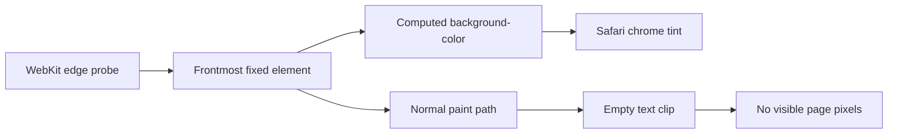

import finalSimulatorPass from "../../../../public/images/blog/safari-26-invisible-tint-sampler/final-simulator-pass.webp";
import finalSimulatorPassDark from "../../../../public/images/blog/safari-26-invisible-tint-sampler/final-simulator-pass-dark.webp";
import safariWebInspector from "../../../../public/images/blog/safari-26-invisible-tint-sampler/safari-web-inspector.webp";
import safariWebInspectorDark from "../../../../public/images/blog/safari-26-invisible-tint-sampler/safari-web-inspector-dark.webp";

The page was already dark. Safari was not.

Its translucent controls stayed pale around the site, then flashed again when I
closed the table of contents drawer or changed the theme. The page itself was
correct. The browser chrome made the whole transition feel broken.

I first treated this as a `theme-color` problem. Then I tried coloring the
document, the body, the fixed header, and a separate 11px strip at the top of the
viewport. That strip finally made Safari use the right color, but it also became
an annoyingly solid piece of the page. Moving it completely off-screen stopped
the tinting. Making it transparent was no more reliable.

The version that survived theme changes, drawers, scrolling, and orientation
changes is stranger: an empty fixed element with a real background color,
clipped to text that does not exist.

<Callout title="Verified on Safari 26" variant="note">
  I tested the final version on July 25, 2026 in Safari on an iPhone 17 Pro
  Simulator running iOS 26.5, including portrait and both landscape directions.
  I also tested the preview branch on a real iPhone. Chrome desktop and its
  responsive mobile view received a separate regression pass.
</Callout>

## Seven weeks for an 11px box

This did not start on July 25. I first worked through Safari 26 tinting on June
6 in
<SourceLink href="https://github.com/exsesx/exsesx.dev/pull/7">pull request 7</SourceLink>.
That investigation found the fixed header as Safari's top color source and used
a 44px solid band to fill the status-bar area. On June 10 I narrowed the
empirical floor to 11px. It looked like the problem was finally contained.

The table of contents drawer proved otherwise. Closing it could make Safari lose
the tint, and the 11px band was still a real painted element. On July 25 I
started the final debugging session with the drawer failure reproduced at 16:26.
The final Simulator capture was at 21:21, almost five hours later.

<Figure
  src={finalSimulatorPass}
  darkSrc={finalSimulatorPassDark}
  alt="Blog page with matching Safari chrome in light and dark mode on the iPhone 17 Pro Simulator at 21:21"
  caption="21:21 on July 25: the final Simulator pass in both themes, with the page and Safari chrome back in one visual world."
  credit="iPhone 17 Pro Simulator, iOS 26.5"
  frame="intrinsic"
/>

By then I was fed up with this bug. Each version could look fixed until a theme
switch, drawer close, or orientation change exposed another weak assumption.
The solid band was the most irritating false win. Safari got the color it
wanted, but readers got an element they should never have had to see.

The history from the first recorded investigation to the invisible sampler spans
exactly seven weeks.

## The problem was bigger than `theme-color`

The HTML standard describes
<SourceLink href="https://html.spec.whatwg.org/multipage/semantics.html#meta-theme-color">`theme-color` as a suggested color</SourceLink>
for the page's surrounding UI. It is still useful metadata, and I kept it as a
fallback. It was not enough to control the Liquid Glass area around a fixed page
surface in my Safari 26 tests.

That behavior is intentional, at least in broad terms. In
<SourceLink href="https://bugs.webkit.org/show_bug.cgi?id=301756">WebKit bug 301756</SourceLink>,
WebKit engineer Wenson Hsieh explains that Safari extends a solid color near an
obscured viewport edge when a `fixed` or `sticky` element is attached there.
Without that extension, scrolling could reveal a gap between the page surface
and Safari's controls. The softer blur on iPhone makes the gap especially
obvious.

This also explains why overlays made the bug look random. A drawer, dialog, or
popover can introduce a new fixed surface above the header. Bug
<SourceLink href="https://bugs.webkit.org/show_bug.cgi?id=302272">302272</SourceLink>
reported that showing a fixed overlay changed the top and bottom tint to the
overlay's background. WebKit marked it as a duplicate of
<SourceLink href="https://bugs.webkit.org/show_bug.cgi?id=300965">bug 300965</SourceLink>,
which covered backdrop colors around modal dialogs. The
<SourceLink href="https://github.com/WebKit/WebKit/commit/2ae949b78743">landed fix and its tests</SourceLink>
explicitly sample the fixed-container edge before opening a dialog, while it is
open, and after it closes.

Safari was not merely reading one meta tag. It was resolving which page surface
owned the viewport edge.

## The fixes that almost worked

The failed versions were useful because each one removed a wrong assumption.

| Attempt                                         | What happened                                                                 |
| ----------------------------------------------- | ----------------------------------------------------------------------------- |
| Update `theme-color`, `html`, and `body`        | Correct at load, but not authoritative once Safari chose a fixed edge surface |
| Reuse the visual header                         | Worked until a drawer or another fixed layer became the frontmost hit         |
| Add a colored 44px, then 11px strip             | Reliable tint, visibly solid at the top of the page                           |
| Move the strip to `top: -9px`                   | Left two painted pixels                                                       |
| Move all 11px off-screen                        | Removed it from Safari's edge sample too                                      |
| Use `opacity: 0` or transparent paint           | Either became ineligible or failed to replace the previously sampled color    |
| Mount and unmount a helper around drawer events | Added timing and lifecycle state without solving every recomputation          |

The two field reports that helped most were
<SourceLink href="https://jahir.dev/blog/safari-toolbar">Jahir Fiquitiva's Safari toolbar experiments</SourceLink>
and
<SourceLink href="https://1ar.io/updates/safari-26-liquid-glass-web/">Pavel Larionov's Safari 26 notes</SourceLink>.
They independently connected the tint to fixed edge geometry and the roughly
11px threshold. Some details vary between Safari builds, though. In particular,
current WebKit source rejects zero-opacity renderers, so I did not treat an
`opacity: 0` result from an earlier build as a stable contract.

After those tests, I had one question: could WebKit see an opaque background
color while the page painted no visible pixels?

## The Simulator made the loop bearable

I did not deploy every CSS guess to Vercel and then open it on my phone. Safari
in the macOS Simulator loaded `localhost:3000`, and Safari Web Inspector attached
to that exact page. I could edit the CSS, refresh, inspect computed styles,
switch the theme, open and close the drawer, and rotate the simulated phone
without leaving the development loop.

<Figure
  src={safariWebInspector}
  darkSrc={safariWebInspectorDark}
  alt="Safari Web Inspector in light and dark appearances, connected to localhost in the iPhone 17 Pro Simulator and showing the page DOM and computed styles"
  caption="Safari Web Inspector attached directly to the Simulator page on localhost, in both light and dark appearances."
  credit="macOS Safari Web Inspector"
  frame="intrinsic"
/>

The Simulator was not a substitute for a real iPhone. It was the fast filter for
bad ideas. Once a version survived the full local matrix, I pushed a preview and
used the real device as the final check. That made this kind of Safari work much
faster than a deploy, test, adjust, and redeploy cycle.

## What WebKit checks at the edge

The answer was in `LocalFrameView::fixedContainerEdges`. I traced the current
implementation at a pinned WebKit revision rather than guessing from screenshots.

For each obscured viewport edge, WebKit constructs a narrow probe, contracts it
slightly, and hit-tests near its midpoint. It then inspects the frontmost
viewport-constrained renderer that reaches that edge. The
<SourceLink href="https://github.com/WebKit/WebKit/blob/0b1757694dabeeb50887ecb95dc800f36ebddf79/Source/WebCore/page/LocalFrameView.cpp#L2293-L2313">edge setup</SourceLink>
and
<SourceLink href="https://github.com/WebKit/WebKit/blob/0b1757694dabeeb50887ecb95dc800f36ebddf79/Source/WebCore/page/LocalFrameView.cpp#L2486-L2508">hit-test path</SourceLink>
make that ordering important.

The candidate classifier then checks that:

- it must be `fixed` or `sticky` and connected to the viewport edge;
- it cannot be hidden or fully transparent;
- a horizontal candidate must cover at least 90 percent of the viewport width;
- WebKit needs a usable, sufficiently solid background color.

The 11px value comes from the direct computed-color shortcut, not basic hit-test
eligibility. `primaryBackgroundColorForRenderer` declines that shortcut when
either border-box dimension is 10px or less. WebKit can then try rendered pixels
or a prior edge color, which is a poor fit for a deliberately paintless box.
The
<SourceLink href="https://github.com/WebKit/WebKit/blob/0b1757694dabeeb50887ecb95dc800f36ebddf79/Source/WebCore/page/LocalFrameView.cpp#L2396-L2415">10px cutoff</SourceLink>
and
<SourceLink href="https://github.com/WebKit/WebKit/blob/0b1757694dabeeb50887ecb95dc800f36ebddf79/Source/WebCore/page/LocalFrameView.cpp#L2417-L2482">candidate checks</SourceLink>
explain the trial-and-error result. Eleven pixels is not a safe-area inset or a
visual spacing choice. It is the first integer CSS height above the cutoff.

What mattered was how WebKit gets the color. The edge sampler reads the
renderer's computed `background-color`. Normal page painting later applies
background clipping in a different path.



The sampler can use one path for Safari's color and another for its own paint.

## The empty text clip

The sampler is an empty `div` mounted before the visual header:

```tsx title="Header.tsx"
<div
  aria-hidden="true"
  className="safari-chrome-sample"
  data-safari-chrome-sample
/>
```

Its mobile WebKit styles are:

```css title="globals.css"
.safari-chrome-sample {
  position: fixed;
  top: 0;
  right: 0;
  left: 0;
  z-index: 2147483647;
  height: 0;
  border: 0;
  outline: 0;
  pointer-events: none;
  background-color: var(--safari-chrome-color);
  background-clip: text;
  -webkit-background-clip: text;
  box-shadow: none;
  transition: none;
}

@supports (-webkit-touch-callout: none) {
  @media (hover: none) and (pointer: coarse) {
    .safari-chrome-sample {
      height: 11px;
    }

    html[data-chrome-sample-refresh] .safari-chrome-sample {
      height: 12px;
    }
  }
}
```

`background-clip: text` does not change the computed background color to
transparent. It only changes where the background is painted. Because the
element contains no text, there are no glyphs to form a paint mask. The element
keeps its full 11px border box and its opaque computed color, but contributes no
visible colored pixels.

The
<SourceLink href="https://github.com/WebKit/WebKit/blob/0b1757694dabeeb50887ecb95dc800f36ebddf79/Source/WebCore/rendering/BackgroundPainter.cpp#L383-L450">WebKit background painter</SourceLink>
handles text clipping separately from the fixed-edge eligibility code. This is
the seam the solution uses.

The huge `z-index` is not what makes the element invisible. It makes the empty
sampler win the single frontmost edge hit even while a drawer or dialog is open.
`pointer-events: none` keeps it out of interaction, while `aria-hidden` and the
empty DOM node keep it out of the accessibility experience.

The height stays at zero outside coarse-touch WebKit. That leaves desktop
layouts and Chrome responsive mode unchanged. Other browsers can parse the base
rule, but there is no painted content and no mobile sampler box for them to lay
out.

## Why the 11px to 12px pulse remains

Changing the CSS variable updated the sampler's computed color, but Safari 26
did not always recompute its cached fixed edge. This was easiest to reproduce
after closing the drawer or switching directly between light and dark themes.

The theme bootstrap therefore changes the candidate's geometry for one painted
frame:

```ts title="no-flash-script.ts"
function refreshSafariChromeSample() {
  window.cancelAnimationFrame(sampleRefreshFrame);
  element.dataset.chromeSampleRefresh = "";

  sampleRefreshFrame = window.requestAnimationFrame(() => {
    sampleRefreshFrame = window.requestAnimationFrame(() => {
      delete element.dataset.chromeSampleRefresh;
      sampleRefreshFrame = 0;
    });
  });
}
```

The data attribute raises the invisible box from 11px to 12px. Two animation
frames ensure that Safari presents the changed geometry before it returns to
11px. The box stays paintless at both sizes.

I call that refresh after applying a theme, on system appearance changes, after
cross-tab storage updates, and on `pageshow`. The no-flash script also sets the
resolved color on the root before the body and fixed header are parsed. That
prevents the document from starting in the light color while a saved dark theme
loads.

The
<SourceLink href="https://github.com/exsesx/exsesx.dev/blob/78400f789695141ad5c565def068b5eee4a219d4/src/styles/globals.css#L603-L652">sampler CSS</SourceLink>
and
<SourceLink href="https://github.com/exsesx/exsesx.dev/blob/78400f789695141ad5c565def068b5eee4a219d4/src/lib/no-flash-script.ts#L1-L65">theme bootstrap</SourceLink>
are both pinned to the real-device-tested commit.

## What I tested

The final pass covered the transitions that had broken earlier versions:

- load in both light and dark themes;
- switch light to dark and dark to light;
- open and close the mobile table of contents in either theme;
- repeat those actions after scrolling deep into an article;
- rotate into both landscape directions, then return to portrait;
- restore the page through `pageshow`;
- inspect desktop Chrome and Chrome responsive mode for layout regressions;
- test the preview branch on a real iPhone.

This does not turn an internal WebKit heuristic into a public browser API.
Safari can change the probe geometry, thresholds, or paint ordering later. The
sampler therefore has a few deliberate maintenance rules: keep it empty, keep
its dimensions above the current cutoff, do not add borders, shadows, pseudo
content, or transitions, and retain `theme-color` as the standards-based
fallback.

I still call this a hack. It relies on a private browser heuristic and a seam
between style inspection and painting. But users cannot see it, Safari now
follows every state that broke the earlier versions, and the tint no longer
breaks the page's immersion. After seven weeks of history and almost five hours
in the final session, I am satisfied with that result.

## Sources

- <SourceLink href="https://bugs.webkit.org/show_bug.cgi?id=301756">WebKit bug 301756: why Safari extends fixed edge colors</SourceLink>
- <SourceLink href="https://bugs.webkit.org/show_bug.cgi?id=302272">WebKit bug 302272: fixed overlays changing the scroll-pocket tint</SourceLink>
- <SourceLink href="https://bugs.webkit.org/show_bug.cgi?id=300965">WebKit bug 300965: dialog backdrop color extension</SourceLink>
- <SourceLink href="https://github.com/WebKit/WebKit/commit/2ae949b78743">WebKit commit 2ae949b: fixed-container backdrop sampling</SourceLink>
- <SourceLink href="https://github.com/WebKit/WebKit/blob/0b1757694dabeeb50887ecb95dc800f36ebddf79/Source/WebCore/page/LocalFrameView.cpp#L2293-L2508">WebKit `LocalFrameView` fixed-edge sampler</SourceLink>
- <SourceLink href="https://github.com/WebKit/WebKit/blob/0b1757694dabeeb50887ecb95dc800f36ebddf79/Source/WebCore/rendering/BackgroundPainter.cpp#L383-L450">WebKit `BackgroundPainter` text clipping path</SourceLink>
- <SourceLink href="https://html.spec.whatwg.org/multipage/semantics.html#meta-theme-color">HTML Standard: `theme-color`</SourceLink>
- <SourceLink href="https://jahir.dev/blog/safari-toolbar">Jahir Fiquitiva: Safari 26 toolbar experiments</SourceLink>
- <SourceLink href="https://1ar.io/updates/safari-26-liquid-glass-web/">Pavel Larionov: Safari 26 Liquid Glass notes</SourceLink>
- <SourceLink href="https://github.com/exsesx/exsesx.dev/pull/34">The implementation and investigation in pull request 34</SourceLink>
