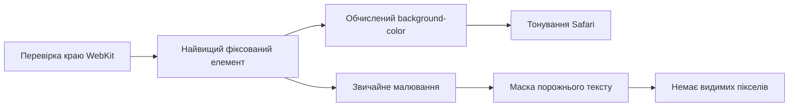

import finalSimulatorPass from "../../../../public/images/blog/safari-26-invisible-tint-sampler/final-simulator-pass.webp";
import finalSimulatorPassDark from "../../../../public/images/blog/safari-26-invisible-tint-sampler/final-simulator-pass-dark.webp";
import safariWebInspector from "../../../../public/images/blog/safari-26-invisible-tint-sampler/safari-web-inspector.webp";
import safariWebInspectorDark from "../../../../public/images/blog/safari-26-invisible-tint-sampler/safari-web-inspector-dark.webp";

Сторінка вже була темною. Safari залишався світлим.

Напівпрозорі елементи браузера не підхоплювали тему сайту, а після закриття
висувної панелі змісту чи перемикання теми знову спалахували блідим кольором.
Сама сторінка виглядала правильно. Усе ламалося на межі між нею та елементами
Safari.

Спочатку я шукав проблему в `theme-color`. Потім задавав колір для документа,
`body`, фіксованої навігації й окремої смуги заввишки 11 пікселів угорі
в’юпорту. Смуга нарешті давала Safari потрібний колір, але водночас ставала
помітною суцільною частиною сторінки. Якщо повністю винести її за екран,
тонування зникало. Прозорість теж не давала стабільного результату.

Лише дивніший варіант залишався стабільним під час перемикання тем, роботи з
панеллю змісту, прокручування й поворотів екрана: порожній фіксований елемент зі
справжнім кольором фону, обрізаним за текстом, якого в елементі немає.

<Callout title="Перевірено в Safari 26" variant="note">
  Остаточний варіант я перевірив 25 липня 2026 року в Safari на симуляторі
  iPhone 17 Pro з iOS 26.5, у портретному режимі й обох напрямках альбомної
  орієнтації. Також я перевірив попередню збірку на справжньому iPhone. Окремо
  прогнав регресійні перевірки в Chrome для настільного й адаптивного режимів.
</Callout>

## Тижні роботи над блоком заввишки 11 пікселів

Ця історія почалася не 25 липня. Уперше я розбирав тонування Safari 26 6 червня
в
<SourceLink href="https://github.com/exsesx/exsesx.dev/pull/7">pull request 7</SourceLink>.
Тоді я визначив фіксовану навігацію як джерело верхнього кольору Safari й
використав суцільну смугу заввишки 44 пікселі для зони статусу. 10 червня я
дослідним шляхом звузив мінімум до 11 пікселів. Здавалося, проблему нарешті
вдалося взяти під контроль.

Закриття мобільної панелі змісту могло збити тонування Safari, а 11-піксельна
смуга все одно залишалася справжнім намальованим елементом. 25 липня я почав
останню сесію налагодження з відтворення помилки о 16:26. Остаточний знімок у
Simulator з’явився о 21:21, майже через п’ять годин.

<Figure
  src={finalSimulatorPass}
  darkSrc={finalSimulatorPassDark}
  alt="Сторінка Блогу з відповідним кольором елементів Safari у світлій і темній темах в iPhone 17 Pro Simulator о 21:21"
  caption="21:21, 25 липня: остаточна перевірка обох тем у Simulator, де кольори сторінки й елементів Safari збігаються."
  credit="iPhone 17 Pro Simulator, iOS 26.5"
/>

На той момент ця помилка вже добряче мене дістала. Кожен варіант міг виглядати
виправленим, доки перемикання теми, закриття панелі змісту чи поворот екрана не
виявляли чергове слабке припущення. Найбільше дратувала суцільна смуга. Safari
отримував потрібний колір, а читачі бачили елемент, якого на сторінці взагалі не
мало бути.

Робота над проблемою, від першого задокументованого дослідження до невидимого
семплера, розтягнулася на кілька тижнів.

## Safari зчитував колір із краю в’юпорту

Стандарт HTML описує
<SourceLink href="https://html.spec.whatwg.org/multipage/semantics.html#meta-theme-color">`theme-color` як рекомендований колір</SourceLink>
для інтерфейсу навколо сторінки. Ці метадані досі корисні, тому я залишив їх як
резервний варіант. Проте в моїх перевірках Safari 26 їх було недостатньо, щоб
керувати кольором Liquid Glass навколо фіксованої поверхні сторінки.

У
<SourceLink href="https://bugs.webkit.org/show_bug.cgi?id=301756">звіті WebKit 301756</SourceLink>
інженер WebKit Wenson Hsieh описує задум механізму: Safari продовжує суцільний
колір біля прихованого краю в’юпорту, коли до нього прив’язаний елемент із
`fixed` або `sticky`. Інакше під час прокручування між поверхнею сторінки й
елементами Safari могла б з’явитися щілина. На iPhone вона особливо помітна
через м’якше розмиття.

Тому накладки й робили помилку схожою на випадковість. Панель змісту, діалог або
`popover` можуть додати нову фіксовану поверхню над навігацією. У
<SourceLink href="https://bugs.webkit.org/show_bug.cgi?id=302272">звіті 302272</SourceLink>
описано, як після появи фіксованої накладки її фон змінював тонування згори й
знизу. WebKit позначив цей звіт як дублікат
<SourceLink href="https://bugs.webkit.org/show_bug.cgi?id=300965">звіту 300965</SourceLink>
про фон модального діалогу. У
<SourceLink href="https://github.com/WebKit/WebKit/commit/2ae949b78743">виправленні та його тестах</SourceLink>
краї фіксованого контейнера зчитуються до відкриття діалогу, під час його показу
й після закриття.

Safari визначав тонування за поверхнею сторінки на краю в’юпорту.

## Варіанти, які майже спрацювали

З кожною невдалою спробою я відкидав одне хибне припущення.

| Спроба                                                             | Результат                                                                                                        |
| ------------------------------------------------------------------ | ---------------------------------------------------------------------------------------------------------------- |
| Оновлювати `theme-color`, `html` і `body`                          | Правильний колір під час завантаження, але він втрачав пріоритет, коли Safari вибирав фіксовану поверхню на краю |
| Використати видиму навігацію                                       | Працювало, доки панель змісту чи інший фіксований шар не опинялися вище                                          |
| Додати кольорову смугу заввишки 44, а потім 11 пікселів            | Стабільне тонування, але видима суцільна смуга вгорі                                                             |
| Пересунути смугу до `top: -9px`                                    | На сторінці залишалися два зафарбовані пікселі                                                                   |
| Винести всі 11 пікселів за екран                                   | Safari теж переставав бачити елемент на краю                                                                     |
| Застосувати `opacity: 0` або прозоре малювання                     | Safari або переставав враховувати елемент, або не замінював попередній колір                                     |
| Монтувати й демонтувати допоміжний елемент разом із панеллю змісту | Додавало часову залежність і стан життєвого циклу, але не охоплювало всіх перерахунків                           |

Найбільше допомогли два практичні дописи:
<SourceLink href="https://jahir.dev/blog/safari-toolbar">експерименти Джахіра Фікітіви з панелями Safari</SourceLink>
і
<SourceLink href="https://1ar.io/updates/safari-26-liquid-glass-web/">нотатки Павла Ларіонова про Safari 26</SourceLink>.
Обидва автори незалежно пов’язали колір із геометрією фіксованого елемента на
краю та порогом близько 11 пікселів. Проте деталі відрізняються між версіями
Safari. Наприклад, актуальний код WebKit відкидає рендерери з нульовою
непрозорістю, тому результат із `opacity: 0` у старішій збірці я не вважав
стабільним контрактом.

Після цих перевірок у мене залишилося одне питання: чи може WebKit побачити
непрозорий колір фону, коли сторінка не малює жодного видимого пікселя?

## Simulator пришвидшив перевірки

Safari в Simulator на macOS завантажував `localhost:3000`, а Safari Web Inspector
під’єднувався саме до цієї сторінки. Я змінював CSS, оновлював сторінку,
перевіряв обчислені стилі, перемикав тему, відкривав і закривав панель змісту та
змінював орієнтацію екрана без окремого розгортання кожного варіанта CSS на
Vercel.

<Figure
  src={safariWebInspector}
  darkSrc={safariWebInspectorDark}
  alt="Safari Web Inspector у світлому й темному оформленні, під’єднаний до localhost в iPhone 17 Pro Simulator, з DOM сторінки та обчисленими стилями"
  caption="Safari Web Inspector, під’єднаний безпосередньо до сторінки з localhost у Simulator, у світлому й темному оформленні."
  credit="Safari Web Inspector у macOS"
/>

У Simulator я швидко відсіював погані ідеї, а на справжньому iPhone робив
остаточну перевірку. Коли версія проходила всю локальну матрицю, я розгортав
попередню збірку й перевіряв її на пристрої. Такий цикл значно швидший за
послідовні розгортання, перевірки й повторні розгортання.

## Що WebKit перевіряє на краю

Відповідь я знайшов у `LocalFrameView::fixedContainerEdges`. Я простежив
реалізацію в зафіксованій ревізії WebKit, а не намагався вгадати її за
скриншотами.

Для кожного прихованого краю в’юпорту WebKit створює вузьку ділянку перевірки,
трохи стискає її та виконує `hit test` біля середини. Далі він аналізує
найвищий у стеку елемент, прив’язаний до в’юпорту й цього краю. У цьому
механізмі важливий порядок дій у
<SourceLink href="https://github.com/WebKit/WebKit/blob/0b1757694dabeeb50887ecb95dc800f36ebddf79/Source/WebCore/page/LocalFrameView.cpp#L2293-L2313">підготовці краю</SourceLink>
та
<SourceLink href="https://github.com/WebKit/WebKit/blob/0b1757694dabeeb50887ecb95dc800f36ebddf79/Source/WebCore/page/LocalFrameView.cpp#L2486-L2508">шляху `hit test`</SourceLink>.

WebKit вважає елемент кандидатом за таких умов:

- має `position: fixed` або `position: sticky` і прилягає до краю в’юпорту;
- не прихований і не повністю прозорий;
- для горизонтального краю перекриває щонайменше 90 відсотків ширини
  в’юпорту;
- має придатний і достатньо суцільний колір фону.

Значення 11 пікселів походить не з базової придатності до `hit test`, а зі
швидкого шляху для обчисленого кольору. `primaryBackgroundColorForRenderer`
не використовує його, якщо хоча б один вимір `border box` не перевищує 10
пікселів. Тоді WebKit може спробувати прочитати намальовані пікселі або попередній
колір краю. Жоден із цих варіантів не підходить для елемента, який навмисно нічого
не малює.
<SourceLink href="https://github.com/WebKit/WebKit/blob/0b1757694dabeeb50887ecb95dc800f36ebddf79/Source/WebCore/page/LocalFrameView.cpp#L2396-L2415">10-піксельний поріг</SourceLink>
і
<SourceLink href="https://github.com/WebKit/WebKit/blob/0b1757694dabeeb50887ecb95dc800f36ebddf79/Source/WebCore/page/LocalFrameView.cpp#L2417-L2482">перевірки кандидата</SourceLink>
пояснюють результат спроб. 11 пікселів не є `safe-area-inset` чи дизайнерським
відступом. Це найменша ціла висота CSS понад поріг.

WebKit отримує колір і малює фон різними шляхами. Під час зчитування краю WebKit
читає обчислений `background-color` елемента. Звичайне малювання сторінки
застосовує обрізання фону пізніше.



## Обрізання за порожнім текстом

Семплер є порожнім `div`, змонтованим перед видимою навігацією:

```tsx title="Header.tsx"
<div
  aria-hidden="true"
  className="safari-chrome-sample"
  data-safari-chrome-sample
/>
```

Для мобільного WebKit він має такі стилі:

```css title="globals.css"
.safari-chrome-sample {
  position: fixed;
  top: 0;
  right: 0;
  left: 0;
  z-index: 2147483647;
  height: 0;
  border: 0;
  outline: 0;
  pointer-events: none;
  background-color: var(--safari-chrome-color);
  background-clip: text;
  -webkit-background-clip: text;
  box-shadow: none;
  transition: none;
}

@supports (-webkit-touch-callout: none) {
  @media (hover: none) and (pointer: coarse) {
    .safari-chrome-sample {
      height: 11px;
    }

    html[data-chrome-sample-refresh] .safari-chrome-sample {
      height: 12px;
    }
  }
}
```

`background-clip: text` не робить обчислений колір фону прозорим. Властивість
лише визначає, де цей фон буде намальовано. Усередині елемента немає тексту,
тому немає і гліфів для маски. Елемент зберігає повну рамку заввишки 11
пікселів і непрозорий обчислений колір, але не додає на сторінку жодного
видимого кольорового пікселя.

Код
<SourceLink href="https://github.com/WebKit/WebKit/blob/0b1757694dabeeb50887ecb95dc800f36ebddf79/Source/WebCore/rendering/BackgroundPainter.cpp#L383-L450">малювання фону WebKit</SourceLink>
обробляє обрізання за текстом окремо від перевірки кандидата на фіксованому
краю. У семплері я використовую це розділення.

Обрізання за порожнім текстом не залишає видимих пікселів. Великий `z-index`
тримає семплер найвище в стеку, навіть коли відкрито панель змісту чи діалог.
`pointer-events: none` не дає йому перехоплювати взаємодію, а `aria-hidden` і
порожній DOM-вузол не створюють зайвого вмісту для допоміжних технологій.

У всіх середовищах, крім мобільного WebKit на пристроях із грубим сенсорним
вказівником, висота залишається нульовою. Тому макети для настільних браузерів і
адаптивний режим Chrome не змінюються. Інші браузери можуть розібрати базове
правило, але не отримують ні намальованого вмісту, ні мобільного блока семплера.

## Навіщо досі потрібна зміна з 11 до 12 пікселів

Після зміни CSS-змінної обчислений колір семплера оновлювався, але Safari 26 не
завжди перераховував кешований фіксований край. Найлегше це було відтворити
після закриття панелі змісту або прямого перемикання між світлою й темною темами.

Тому під час застосування теми початковий скрипт на один намальований кадр
змінює геометрію кандидата:

```ts title="no-flash-script.ts"
function refreshSafariChromeSample() {
  window.cancelAnimationFrame(sampleRefreshFrame);
  element.dataset.chromeSampleRefresh = "";

  sampleRefreshFrame = window.requestAnimationFrame(() => {
    sampleRefreshFrame = window.requestAnimationFrame(() => {
      delete element.dataset.chromeSampleRefresh;
      sampleRefreshFrame = 0;
    });
  });
}
```

Атрибут даних збільшує висоту невидимого блока з 11 до 12 пікселів. Два
анімаційні кадри дають Safari показати змінену геометрію, перш ніж повернутися
до 11 пікселів. В обох станах блок нічого не малює.

Я запускаю це оновлення після застосування теми, під час системної зміни
оформлення, після синхронізації сховища між вкладками й у події `pageshow`.
Скрипт проти спалаху також задає кореневому елементу колір поточної теми ще до
розбору `body` і фіксованої навігації. Завдяки цьому документ не починає зі
світлого кольору, якщо збережена темна тема.

<SourceLink href="https://github.com/exsesx/exsesx.dev/blob/78400f789695141ad5c565def068b5eee4a219d4/src/styles/globals.css#L603-L652">CSS семплера</SourceLink>
та
<SourceLink href="https://github.com/exsesx/exsesx.dev/blob/78400f789695141ad5c565def068b5eee4a219d4/src/lib/no-flash-script.ts#L1-L65">початковий скрипт теми</SourceLink>
прив’язані до коміту, який я перевірив на справжньому пристрої.

## Що я перевірив

Остаточна перевірка охопила переходи, на яких ламалися попередні варіанти:

- початкове завантаження у світлій і темній темах;
- перемикання зі світлої теми на темну та навпаки;
- відкриття й закриття мобільної панелі змісту в обох темах;
- ті самі дії після прокручування далеко вглиб статті;
- обидва напрямки альбомної орієнтації та повернення до портретної;
- відновлення сторінки через `pageshow`;
- перевірку настільного Chrome та його адаптивного режиму на регресії макета;
- попередню збірку на справжньому iPhone.

Це не перетворює внутрішню евристику WebKit на публічний API браузера. Safari
може змінити геометрію перевірки, порогові значення чи порядок малювання. Тому
семплер має кілька правил підтримки: залишати елемент порожнім,
тримати його розміри вище поточного порога, не додавати рамок, тіней,
псевдовмісту чи переходів і зберігати `theme-color` як стандартний резервний
варіант.

Я досі називаю це хаком, бо він спирається на приватну евристику браузера та
окремі шляхи перевірки стилю й малювання. Користувачі не бачать семплер, а
Safari зберігає правильний колір у всіх станах, де попередні варіанти давали
збій. Після кількох тижнів роботи та майже п’яти годин в останній сесії я
задоволений результатом.

## Джерела

- <SourceLink href="https://bugs.webkit.org/show_bug.cgi?id=301756">Звіт WebKit 301756: чому Safari продовжує кольори фіксованого краю</SourceLink>
- <SourceLink href="https://bugs.webkit.org/show_bug.cgi?id=302272">Звіт WebKit 302272: зміна тонування після появи фіксованих накладок</SourceLink>
- <SourceLink href="https://bugs.webkit.org/show_bug.cgi?id=300965">Звіт WebKit 300965: продовження кольору фону діалогу</SourceLink>
- <SourceLink href="https://github.com/WebKit/WebKit/commit/2ae949b78743">Коміт WebKit 2ae949b: зчитування фону фіксованого контейнера</SourceLink>
- <SourceLink href="https://github.com/WebKit/WebKit/blob/0b1757694dabeeb50887ecb95dc800f36ebddf79/Source/WebCore/page/LocalFrameView.cpp#L2293-L2508">Механізм фіксованого краю в `LocalFrameView` WebKit</SourceLink>
- <SourceLink href="https://github.com/WebKit/WebKit/blob/0b1757694dabeeb50887ecb95dc800f36ebddf79/Source/WebCore/rendering/BackgroundPainter.cpp#L383-L450">Обрізання за текстом у `BackgroundPainter` WebKit</SourceLink>
- <SourceLink href="https://html.spec.whatwg.org/multipage/semantics.html#meta-theme-color">Стандарт HTML: `theme-color`</SourceLink>
- <SourceLink href="https://jahir.dev/blog/safari-toolbar">Джахір Фікітіва: експерименти з панелями Safari 26</SourceLink>
- <SourceLink href="https://1ar.io/updates/safari-26-liquid-glass-web/">Павло Ларіонов: нотатки про Liquid Glass у Safari 26</SourceLink>
- <SourceLink href="https://github.com/exsesx/exsesx.dev/pull/34">Реалізація та дослідження в pull request 34</SourceLink>
